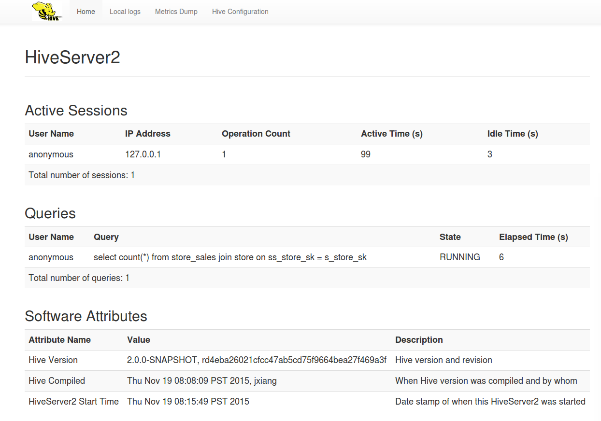

# Setting Up HiveServer2

[TOC]

> [HiveServer2](https://cwiki.apache.org/confluence/display/Hive/HiveServer2+Overview) (HS2) is a server interface that enables remote clients to execute queries against Hive and retrieve the results (a more detailed intro [here](https://cwiki.apache.org/confluence/display/Hive/HiveServer2+Overview)). The current implementation, based on Thrift RPC, is an improved version of [HiveServer](https://cwiki.apache.org/confluence/display/Hive/HiveServer) and supports multi-client concurrency and authentication. It is designed to provide better support for open API clients like JDBC and ODBC.

HiveServer2 是一个服务接口，启用远程客户端执行查询，接收结果。基于 Thrift RPC 的当前的实现是对 HiveServer 的改进版本，**支持多客户端并发和身份验证。它用来为开放 API 客户端(如JDBC、ODBC)提供更好的支持**。

> - The Thrift interface definition language (IDL) for HiveServer2 is available at [https://github.com/apache/hive/blob/trunk/service/if/TCLIService.thrift](https://github.com/apache/hive/blob/trunk/service/if/TCLIService.thrift).

> - Thrift documentation is available at [http://thrift.apache.org/docs/](http://thrift.apache.org/docs/).

> This document describes how to set up the server. How to use a client with this server is described in the [HiveServer2 Clients document](https://cwiki.apache.org/confluence/display/Hive/HiveServer2+Clients).

本文档描述了如何配置服务。

> Version:Introduced in Hive version 0.11. See [HIVE-2935](https://issues.apache.org/jira/browse/HIVE-2935).

版本：在 Hive 0.11 引入。

## 1、How to Configure

### 1.1、Configuration Properties in the hive-site.xml File

> Configuration Properties in the hive-site.xml File

**`hive-site.xml` 中的配置属性：**

	hive.server2.thrift.min.worker.threads – Minimum number of worker threads, default 5. 【worker线程的最小数量，默认是5】

	hive.server2.thrift.max.worker.threads – Maximum number of worker threads, default 500.  【worker线程的最大数量，默认是5】

	hive.server2.thrift.port – TCP port number to listen on, default 10000. 【监听的TCP端口，默认是10000】

	hive.server2.thrift.bind.host – TCP interface to bind to.【绑定的TCP接口】

> See [HiveServer2 in the Configuration Properties document](https://cwiki.apache.org/confluence/display/Hive/Configuration+Properties#ConfigurationProperties-HiveServer2) for additional properties that can be set for HiveServer2 .

见配置属性文档中的 HiveServer2 ，描述了设置 HiveServer2 的额外属性。

### 1.2、Optional Environment Settings

	HIVE_SERVER2_THRIFT_BIND_HOST – Optional TCP host interface to bind to. Overrides the configuration file setting. 
	【可选的绑定的TCP主机接口，覆盖配置文件的设置】
	
	HIVE_SERVER2_THRIFT_PORT – Optional TCP port number to listen on, default 10000. Overrides the configuration file setting.
	【可选的监听的TCP端口，默认是10000，覆盖配置文件的设置】

### 1.3、Running in HTTP Mode

> HiveServer2 provides support for sending Thrift RPC messages over HTTP transport (Hive 0.13 onward, see [HIVE-4752](https://issues.apache.org/jira/browse/HIVE-4752)). This is particularly useful to support a proxying intermediary between the client and the server (for example, for load balancing or security reasons). Currently, you can run HiveServer2 in either TCP mode or the HTTP mode, but not in both. For the corresponding JDBC URL check this link: [HiveServer2 Clients -- JDBC Connection URLs](https://cwiki.apache.org/confluence/display/Hive/HiveServer2+Clients#HiveServer2Clients-JDBC). Use the following settings to enable and configure HTTP mode:

**HiveServer2 提供了通过 HTTP transport 发送 Thrift RPC 消息的支持**。

这对于支持客户端和服务器之间的代理中介非常有用(例如，出于负载平衡或安全原因)。

目前，**你可以在 TCP 模式或 HTTP 模式下运行 HiveServer2，但不能同时在两种模式下运行**。

对于相应的 JDBC URL，查看这个：`HiveServer2 Clients -- JDBC Connection URLs`。

**使用以下设置启用和配置 HTTP 模式:**

Setting | Default | Description
---|:---|:---
[hive.server2.transport.mode](https://cwiki.apache.org/confluence/display/Hive/Configuration+Properties#ConfigurationProperties-hive.server2.transport.mode) | binary | Set to http to enable HTTP transport mode 【设置为HTTP，启用HTTP transport模式】
[hive.server2.thrift.http.port](https://cwiki.apache.org/confluence/display/Hive/Configuration+Properties#ConfigurationProperties-hive.server2.thrift.http.port) | 10001 | HTTP port number to listen on 【监听的HTTP端口】
[hive.server2.thrift.http.max.worker.threads](https://cwiki.apache.org/confluence/display/Hive/Configuration+Properties#ConfigurationProperties-hive.server2.thrift.http.max.worker.threads) | 500 | Maximum worker threads in the server pool 【服务池中的最大worker线程数】
[hive.server2.thrift.http.min.worker.threads](https://cwiki.apache.org/confluence/display/Hive/Configuration+Properties#ConfigurationProperties-hive.server2.thrift.http.min.worker.threads) | 5 | Minimum worker threads in the server pool 【服务池中的最小worker线程数】
[hive.server2.thrift.http.path](https://cwiki.apache.org/confluence/display/Hive/Configuration+Properties#ConfigurationProperties-hive.server2.thrift.http.path) | cliservice | The service endpoint

#### 1.3.1、Cookie Based Authentication

> [HIVE-9709](https://issues.apache.org/jira/browse/HIVE-9709) and [HIVE-9710](https://issues.apache.org/jira/browse/HIVE-9710) introduced cookie based authentication for HiveServer2 in HTTP mode. The HiveServer2 parameters (`hive.server2.thrift.http.cookie.*`) associated with this change can be found [here](https://cwiki.apache.org/confluence/display/Hive/Configuration+Properties#ConfigurationProperties-hive.server2.thrift.http.cookie.auth.enabled).

在 HTTP 模式下引入了基于 cookie 的身份验证。与此更改相关的 HiveServer2 参数(`hive.server2.thrift.http.cookie.*`)可以在这里找到。

### 1.4、Optional Global Init File

> A global init file can be placed in the configured [hive.server2.global.init.file.location](https://cwiki.apache.org/confluence/display/Hive/Configuration+Properties#ConfigurationProperties-hive.server2.global.init.file.location) location (Hive 0.14 onward, see [HIVE-5160](https://issues.apache.org/jira/browse/HIVE-5160), [HIVE-7497](https://issues.apache.org/jira/browse/HIVE-7497), and [HIVE-8138](https://issues.apache.org/jira/browse/HIVE-8138)). This can be either the path to the init file itself, or a directory where an init file named ".hiverc" is expected.

**一个全局的初始文件可以放在 `hive.server2.global.init.file.location` 指向的路径下**。这个可以是初始文件本身的路径，也可以是命名为 `.hiverc` 的初始文件的所在目录。

> The init file lists a set of commands that will run for users of this HiveServer2 instance, such as register a standard set of jars and functions.

**初始文件为在这个 HiveServer2 实例上的用户列出了一系列运行命令**，如，注册一组标准的 jars 和函数。

### 1.5、Logging Configuration

> HiveServer2 operation logs are available for Beeline clients (Hive 0.14 onward). These parameters configure logging:

**HiveServer2 操作日志对 Beeline 客户端是可用的**(从 Hive 0.14 开始)。这些参数配置日志:

- [hive.server2.logging.operation.enabled](https://cwiki.apache.org/confluence/display/Hive/Configuration+Properties#ConfigurationProperties-hive.server2.logging.operation.enabled)
- [hive.server2.logging.operation.log.location](https://cwiki.apache.org/confluence/display/Hive/Configuration+Properties#ConfigurationProperties-hive.server2.logging.operation.log.location)
- [hive.server2.logging.operation.verbose](https://cwiki.apache.org/confluence/display/Hive/Configuration+Properties#ConfigurationProperties-hive.server2.logging.operation.verbose) (Hive 0.14 to 1.1)
- [hive.server2.logging.operation.level](https://cwiki.apache.org/confluence/display/Hive/Configuration+Properties#ConfigurationProperties-hive.server2.logging.operation.level) (Hive 1.2 onward)

## 2、How to Start

	$HIVE_HOME/bin/hiveserver2

或者

	$HIVE_HOME/bin/hive --service hiveserver2

### 2.1、Usage Message

> The -H or --help option displays a usage message, for example:

`-H` 或 `--help` 选项列出用法信息，如：

	$HIVE_HOME/bin/hive --service hiveserver2 -H
	Starting HiveServer2
	usage: hiveserver2
	 -H,--help                        Print help information
	    --hiveconf <property=value>   Use value for given property

## 3、Authentication/Security Configuration

> HiveServer2 supports Anonymous (no authentication) with and without SASL, Kerberos (GSSAPI), pass through LDAP, Pluggable Custom Authentication and Pluggable Authentication Modules (PAM, supported Hive 0.13 onwards).

**HiveServer2 支持匿名(无身份验证)**，有或没有 SASL、Kerberos (GSSAPI)、通过 LDAP、可拔插的自定义身份验证和可插身份验证模块(PAM，支持 Hive 0.13)。

### 3.1、Configuration

> Authentication mode:

- 身份验证模式：

	hive.server2.authentication -- 身份验证模式，默认是NONE，选项有 NONE (uses plain SASL), NOSASL, KERBEROS, LDAP, PAM, CUSTOM.

> hive.server2.authentication – Authentication mode, default NONE. Options are NONE (uses plain SASL), NOSASL, KERBEROS, LDAP, PAM and CUSTOM.

> Set following for KERBEROS mode:

- 为 KERBEROS 模式设置如下：

	hive.server2.authentication.kerberos.principal – Kerberos principal for server.

	hive.server2.authentication.kerberos.keytab – Keytab for server principal.

> Set following for LDAP mode:

- 为 LDAP 模式设置如下：

	[hive.server2.authentication.ldap.url](https://cwiki.apache.org/confluence/display/Hive/Configuration+Properties#ConfigurationProperties-hive.server2.authentication.ldap.url) – LDAP URL (for example, ldap://hostname.com:389).

	[hive.server2.authentication.ldap.baseDN](https://cwiki.apache.org/confluence/display/Hive/Configuration+Properties#ConfigurationProperties-hive.server2.authentication.ldap.baseDN) – LDAP base DN. (Optional for AD.)

	[hive.server2.authentication.ldap.Domain](https://cwiki.apache.org/confluence/display/Hive/Configuration+Properties#ConfigurationProperties-hive.server2.authentication.ldap.Domain) – LDAP domain. (Hive 0.12.0 and later.)

> See [User and Group Filter Support with LDAP Atn Provider in HiveServer2](https://cwiki.apache.org/confluence/display/Hive/User+and+Group+Filter+Support+with+LDAP+Atn+Provider+in+HiveServer2) for other LDAP configuration parameters in Hive 1.3.0 and later.

> Set following for CUSTOM mode:

- 为 CUSTOM 模式设置如下：

	hive.server2.custom.authentication.class – Custom authentication class that implements the org.apache.hive.service.auth.PasswdAuthenticationProvider interface.

> For PAM mode, see details in [section on PAM](https://cwiki.apache.org/confluence/display/Hive/Setting+Up+HiveServer2#SettingUpHiveServer2-PluggableAuthenticationModules(PAM)) below.

### 3.2、Impersonation

> By default HiveServer2 performs the query processing as the user who submitted the query. But if the following parameter is set to false, the query will run as the user that the hiveserver2 process runs as.

**默认情况下，HiveServer2 作为提交查询的用户执行查询处理。但是，如果将下面的参数设置为 false，则作为 hiveserver2 进程运行时的用户，运行查询**。

	hive.server2.enable.doAs – Impersonate(模仿) the connected user, default true.

> To prevent memory leaks in unsecure mode, disable file system caches by setting the following parameters to true (see [HIVE-4501](https://issues.apache.org/jira/browse/HIVE-4501)):

**为防止在非安全模式下内存泄漏，通过设置下列属性为 true，来禁用文件系统缓存：**

	fs.hdfs.impl.disable.cache – Disable HDFS filesystem cache, default false.

	fs.file.impl.disable.cache – Disable local filesystem cache, default false.

### 3.3、Integrity/Confidentiality Protection

> Integrity protection and confidentiality protection (beyond just the default of authentication) for communication between the Hive JDBC driver and HiveServer2 are enabled (Hive 0.12 onward, see [HIVE-4911](https://issues.apache.org/jira/browse/HIVE-4911)). You can use the [SASL QOP](http://en.wikipedia.org/wiki/Simple_Authentication_and_Security_Layer) property to configure this.

**对 Hive JDBC driver 和 HiveServer2 之间的通信，启用了完整性保护和机密性保护(不只是默认的身份验证)。可以使用 SASL QOP 属性来对此进行配置。**

> This is only when Kerberos is used for the HS2 client (JDBC/ODBC application) authentication with HiveServer2.

- 只有在使用 HiveServer2 对 HS2 客户端(JDBC/ODBC应用程序)身份验证时才使用 Kerberos。

> hive.server2.thrift.sasl.qop in hive-site.xml has to be set to one of the valid [QOP](http://docs.oracle.com/javase/7/docs/api/javax/security/sasl/Sasl.html#QOP) values ('auth', 'auth-int' or 'auth-conf').

- `hive-site.xml` 中的 `hive.server2.thrift.sasl.qop` 必须设置为有效的 QOP 值。('auth', 'auth-int' or 'auth-conf')

### 3.4、SSL Encryption

> Support is provided for SSL encryption (Hive 0.13 onward, see [HIVE-5351](https://issues.apache.org/jira/browse/HIVE-5351)). To enable, set the following configurations in hive-site.xml:

支持 SSL 加密。在 `hive-site.xml` 中设置如下配置，来启用：

	hive.server2.use.SSL – Set this to true.

	hive.server2.keystore.path – Set this to your keystore path.

	hive.server2.keystore.password – Set this to your keystore password.

> Note:When hive.server2.transport.mode is binary and hive.server2.authentication is KERBEROS, SSL encryption did not work until Hive 2.0. Set hive.server2.thrift.sasl.qop to auth-conf to enable encryption. See [HIVE-14019](https://issues.apache.org/jira/browse/HIVE-14019) for details.

当 `hive.server2.transport.mode` 是 binary 和 `hive.server2.authentication` 是 KERBEROS，SSL 加密，直到 Hive 2.0 才开始起作用。设置`hive.server2.thrift.sasl.qop`为 auth-conf 来启用加密。

#### 3.4.1、Setting up SSL with self-signed certificates

> Use the following steps to create and verify self-signed SSL certificates for use with HiveServer2:

通过以下步骤创建和验证 HiveServer2 使用的自签名 SSL 证书:

> Create the self signed certificate and add it to a keystore file using:  keytool -genkey -alias example.com -keyalg RSA -keystore keystore.jks -keysize 2048 Ensure the name used in the self signed certificate matches the hostname where HiveServer2 will run.

1.创建自签名证书，并使用`keytool -genkey -alias example.com -keyalg RSA -keystore keystore.jks -keysize 2048`，将其添加到 keystore 文件中。确保自签名证书中使用的名称与运行 HiveServer2 的主机名匹配。

> List the keystore entries to verify that the certificate was added. Note that a keystore can contain multiple such certificates: keytool -list -keystore keystore.jks

2.列出 keystore 条目，以验证是否添加了证书。注意，一个 keystore 可以包含多个这样的证书:`keytool -list -keystore keystore.jks`

> Export this certificate from keystore.jks to a certificate file: keytool -export -alias example.com -file example.com.crt -keystore keystore.jks

3.从 `keystore.jks` 导出此证书到证书文件:`keytool -export -alias example.com -file example.com.crt -keystore keystore.jks`

> Add this certificate to the client's truststore to establish trust: keytool -import -trustcacerts -alias example.com -file example.com.crt -keystore truststore.jks

4.将此证书添加到客户端的信任存储中以建立信任:`keytool -import -trustcacerts -alias example.com -file example.com.crt -keystore truststore.jks`

> Verify that the certificate exists in truststore.jks: keytool -list -keystore truststore.jks

5.验证证书是否存在于 truststore.jks 中:`keytool -list -keystore truststore.jks`

> Then start HiveServer2, and try to connect with beeline using: jdbc:hive2://<host>:<port>/<database>;ssl=true;sslTrustStore=<path-to-truststore>;trustStorePassword=<truststore-password>

6.然后启动 HiveServer2，尝试使用beeline连接:`jdbc:hive2://<host>:<port>/<database>;ssl=true;sslTrustStore=<path-to-truststore>;trustStorePassword=<truststore-password>`

#### 3.4.2、Selectively disabling SSL protocol versions

> To disable specific SSL protocol versions, use the following steps:

要禁用特定的 SSL 协议版本，请使用以下步骤:

> Run openssl ciphers -v (or the corresponding command if not using openssl) to view all protocol versions.

1.运行 ` openssl ciphers -v`(如果不使用openssl，则运行相应的命令)来查看所有协议版本。

> In addition to 1, an additional step of going over the HiveServer2 logs may be required to see all the protocols that the node running HiveServer2 is supporting. For that, search for "SSL Server Socket Enabled Protocols:" in the HiveServer2 log file. 

2.除了 1 之外，可能还需要检查 HiveServer2 日志，以查看运行 HiveServer2 的节点所支持的所有协议。为此，在 HiveServer2 日志文件中搜索 `SSL Server Socket Enabled Protocols:`。

> Add all the SSL protocols that need to be disabled to hive.ssl.protocol.blacklist. Ensure that the property in hiveserver2-site.xml does not override that in hive-site.xml.

3.将需要禁用的所有 SSL 协议添加到 `hive.ssl.protocol.blacklist` 中。确保 `hiveserver2-site.xml` 中的属性不会覆盖 `hive-site.xml` 中的属性。

### 3.5、Pluggable Authentication Modules (PAM)

> Warning:[JPAM](http://jpam.sourceforge.net/) library that is used to provide the PAM authentication mode can cause HiveServer2 to go down if a user's password has expired. This happens because of segfault/core dumps from native code invoked by JPAM. Some users have also reported crashes during logins in other cases as well. Use of LDAP or KERBEROS is recommended.

如果用户的密码过期，用于提供 PAM 身份验证模式的 JPAM 库可能导致 HiveServer2 关闭。这是因为 JPAM 调用的本地代码产生了segfault/core 转储。在其他情况下，一些用户也报告登录时崩溃。建议使用 LDAP 或 KERBEROS。

> Support is provided for PAM (Hive 0.13 onward, see [HIVE-6466](https://issues.apache.org/jira/browse/HIVE-6466)). To configure PAM:

提供了对 PAM 的支持。配置 PAM:

> Download the [JPAM](http://sourceforge.net/projects/jpam/files/jpam/jpam-1.1/) native library for the relevant architecture.

1.下载相关体系结构的 JPAM 本机库。

> Unzip and copy libjpam.so to a directory (<libjmap-directory>) on the system. 

2.解压缩，复制 `libjpam.so`到系统上的 `<libjmap-directory>` 目录。

> Add the directory to the LD_LIBRARY_PATH environment variable like so: export LD_LIBRARY_PATH=$LD_LIBRARY_PATH:<libjmap-directory> 

3.将目录添加到 LD_LIBRARY_PATH 环境变量:`export LD_LIBRARY_PATH=$LD_LIBRARY_PATH:<libjmap-directory> `

> For some PAM modules, you'll have to ensure that your /etc/shadow and /etc/login.defs files are readable by the user running the HiveServer2 process.

4.对于某些 PAM 模块，必须确保运行在 HiveServer2 进程上的用户可以读 `/etc/shadow` 和 `/etc/login.defs` 文件。

> Finally, set the following configurations in hive-site.xml:

最后，在 `hive-site.xml` 中设置以下配置:

	hive.server2.authentication – Set this to PAM.

	hive.server2.authentication.pam.services – Set this to a list of comma-separated PAM services that will be used. Note that a file with the same name as the PAM service must exist in /etc/pam.d 
	【设置这个为逗号分隔的使用的PAM服务列表。注意，与PAM服务同名的文件必须存在于/etc/pam.d中】

### 3.6、Setting up HiveServer2 job credential provider

> Starting Hive 2.2.0 onwards (see [HIVE-14822](https://issues.apache.org/jira/browse/HIVE-14822)) Hiveserver2 supports job specific hadoop credential provider for MR and Spark jobs. When using encrypted passwords via the Hadoop Credential Provider, HiveServer2 needs to forward enough information to the job configuration so that jobs launched across cluster can read those secrets. Additionally, HiveServer2 may have secrets that the job should not have such as the Hive Metastore database password. If your job needs to access such secrets, like S3 credentials, then you can configure them using the configuration steps below:

从 Hive 2.2.0 开始， Hiveserver2 为 MR 和 Spark 作业支持作业的特定 hadoop 凭据提供者。

当通过 Hadoop Credential Provider 使用加密的密码时，HiveServer2 需要将足够的信息转发给作业配置，以便跨集群启动的作业可以读取这些秘密。

此外，HiveServer2 可能具有作业不应该具有的秘密，如 Hive Metastore database 密码。

如果你的作业需要访问这些秘密，比如 S3 凭证，那么你可以使用下面的配置步骤来配置它们:

> Create a job-specific keystore using Hadoop Credential Provider API at a secure location in HDFS. This keystore should contain the encrypted key/value pairs of the configurations needed by jobs. Eg: in case of S3 credentials the keystore should contain fs.s3a.secret.key and fs.s3a.access.key with their corresponding values.

1.在 HDFS 中的安全位置，使用 Hadoop Credential Provider API 创建一个特定于作业的 keystore。这个 keystore 应该包含作业所需的配置的键值对。对于 S3 凭证，keystore 应该包含 `fs.s3a.secret.key` 和 `fs.s3a.access.key` 及其对应值。

> The password to decrypt the keystore should be set as a HiveServer2 environment variable called HIVE_JOB_CREDSTORE_PASSWORD

2.解密 keystore 的密码应该设置为 HiveServer2 环境变量 `HIVE_JOB_CREDSTORE_PASSWORD`

> Set hive.server2.job.credential.provider.path to URL pointing to the type and location of keystore created in (1) above. If there is no job-specific keystore, HiveServer2 will use the one set using hadoop.credential.provider.path in core-site.xml if available.

3.设置 `hive.server2.job.credential.provider.path` 指向上面(1)中创建的 keystore 的类型和位置的 URL 路径。如果没有特定于作业的 keystore，HiveServer2 将使用 `core-site.xml` 中的`hadoop.credential.provider.path`来设置。

> If the password using environment variable set in step 2 is not provided, HiveServer2 will use HADOOP_CREDSTORE_PASSWORD environment variable if available.

4.如果步骤2中使用环境变量设置的密码没有提供，HiveServer2 将使用 `HADOOP_CREDSTORE_PASSWORD` 环境变量(如果可用)。

> HiveServer2 will now modify the job configuration of the jobs launched using MR or Spark execution engines to include the job credential provider so that job tasks can access the encrypted keystore with the secrets. 

5.HiveServer2 现在将修改使用 MR 或 Spark 执行引擎启动的作业的作业配置，以包含作业凭据提供程序，以便作业任务可以使用机密访问加密的 keystore。

	hive.server2.job.credential.provider.path – Set this to your job-specific hadoop credential provider. Eg: jceks://hdfs/user/hive/secret/jobcreds.jceks.

	HIVE_JOB_CREDSTORE_PASSWORD – Set this HiveServer2 environment variable to your job specific Hadoop credential provider password set above.

## 4、Scratch Directory Management

> HiveServer2 allows the configuration of various aspects of scratch directories, which are used by Hive to store temporary output and plans.

HiveServer2 允许对 scratch 目录的各个方面进行配置，Hive 使用这些目录存储临时输出和计划。

### 4.1、Configuration Properties

> The following are the properties that can be configured related to scratch directories:

下面的配置是和 scratch 目录相关的配置：

- [hive.scratchdir.lock](https://cwiki.apache.org/confluence/display/Hive/Configuration+Properties#ConfigurationProperties-hive.scratchdir.lock)
- hive.exec.scratchdir](https://cwiki.apache.org/confluence/display/Hive/Configuration+Properties#ConfigurationProperties-hive.exec.scratchdir)
- hive.scratch.dir.permission](https://cwiki.apache.org/confluence/display/Hive/Configuration+Properties#ConfigurationProperties-hive.scratch.dir.permission)
- hive.start.cleanup.scratchdir](https://cwiki.apache.org/confluence/display/Hive/Configuration+Properties#ConfigurationProperties-hive.start.cleanup.scratchdir)

### 4.2、ClearDanglingScratchDir Tool

> The tool cleardanglingscratchdir can be run to clean up any dangling scratch directories that might be left over from improper shutdowns of Hive, such as when a virtual machine restarts and leaves no chance for Hive to run the shutdown hook.

cleardanglingscratchdir 工具可以用来清理任何悬空的 scratch 目录，这些目录可能是由于 Hive 的不适当关闭而遗留下来的，比如当虚拟机重新启动时，Hive 没有机会运行关闭钩子。

	hive --service cleardanglingscratchdir [-r] [-v] [-s scratchdir]
	    -r      dry-run mode, which produces a list on console 
	    	    【运行模式，它在控制台产生一个列表】
	    -v      verbose mode, which prints extra debugging information
	            【详细模式，打印额外的调试信息】
	    -s      if you are using non-standard scratch directory
	            【如果你使用的是非标准的临时目录】

> The tool tests if a scratch directory is in use, and if not, will remove it. This relies on HDFS write locks to detect if a scratch directory is in use. An HDFS client opens an HDFS file ($scratchdir/inuse.lck) for writing and only closes it at the time that the session is closed. cleardanglingscratchdir will try to open $scratchdir/inuse.lck for writing to test if the corresponding HiveCli/HiveServer2 is still running. If the lock is in use, the scratch directory will not be cleared. If the lock is available, the scratch directory will be cleared. Note that it might take NameNode up to 10 minutes to reclaim the lease on scratch file locks from a dead HiveCli/HiveServer2, at which point cleardanglingscratchdir will be able to remove it if run again.

该工具测试是否使用了 scratch 目录，如果没有，将删除该目录。

这依赖于 HDFS 写锁来检测是否使用了一个 scratch 目录。HDFS 客户端打开一个 HDFS 文件($scratchdir/inuse.lck)进行写入，只在会话关闭时关闭它。

cleardanglingscratchdir 将尝试打开 `$scratchdir/inuse.lck`，用于编写测试对应的 HiveCli/HiveServer2 是否仍在运行。

如果使用了锁，则不会清除 scratch 目录。如果锁可用，则将清除 scratch 目录。

请注意，NameNode 可能需要10分钟才能从已死的 HiveCli/HiveServer2 中收回 scratch 文件锁的租约，此时，如果再次运行，cleardanglingscratchdir 将能够删除它。

## 5、Web UI for HiveServer2

> Version:Introduced in Hive 2.0.0. See [HIVE-12338](https://issues.apache.org/jira/browse/HIVE-12338) and its sub-tasks.

版本：在 Hive 2.0.0 引入。

> A Web User Interface (UI) for HiveServer2 provides configuration, logging, metrics and active session information. The Web UI is available at port 10002 (127.0.0.1:10002) by default.  

HiveServer2 的 web UI 提供了配置、日志、度量和活跃会话信息。默认端口是10002。

> [Configuration properties](https://cwiki.apache.org/confluence/display/Hive/Configuration+Properties#ConfigurationProperties-HiveServer2WebUI) for the Web UI can be [customized in hive-site.xml](https://cwiki.apache.org/confluence/display/Hive/AdminManual+Configuration#AdminManualConfiguration-hive-site.xmlandhive-default.xml.template), including hive.server2.webui.host, hive.server2.webui.port, hive.server2.webui.max.threads, and others. 

> [Hive Metrics](https://cwiki.apache.org/confluence/display/Hive/Hive+Metrics) can by viewed by using the "Metrics Dump" tab. 

> [Logs](https://cwiki.apache.org/confluence/display/Hive/GettingStarted#GettingStarted-HiveLogging) can be viewed by using the "Local logs" tab.

> The interface is currently under development with [HIVE-12338](https://issues.apache.org/jira/browse/HIVE-12338).



## 6、Python Client Driver

> A Python client driver for HiveServer2 is available at [https://github.com/BradRuderman/pyhs2](https://github.com/BradRuderman/pyhs2) (thanks, Brad). It includes all the required packages such as SASL and Thrift wrappers.

HiveServer2 的 Python 客户端驱动程序可以通过 https://github.com/BradRuderman/pyhs2 获得。它包括所有必需的包，比如 SASL 和 Thrift 包装器。

> The driver has been certified for use with Python 2.6 and newer.

该驱动程序已经通过认证，可以在 Python 2.6 及更新版本中使用。

> To use the [pyhs2](https://github.com/BradRuderman/pyhs2) driver:

要使用pyhs2驱动程序:

	pip install pyhs2

> and then:

```python
import pyhs2
 
with pyhs2.connect(host='localhost',
                   port=10000,
                   authMechanism="PLAIN",
                   user='root',
                   password='test',
                   database='default') as conn:
    with conn.cursor() as cur:
        #Show databases
        print cur.getDatabases()
 
        #Execute query
        cur.execute("select * from table")
  
        #Return column info from query
        print cur.getSchema()
 
        #Fetch table results
        for i in cur.fetch():
            print i
```

> You can discuss this driver on the user@hive.apache.org mailing list.

## 7、Ruby Client Driver

> A Ruby client driver is available on github at [https://github.com/forward3d/rbhive](https://github.com/forward3d/rbhive).