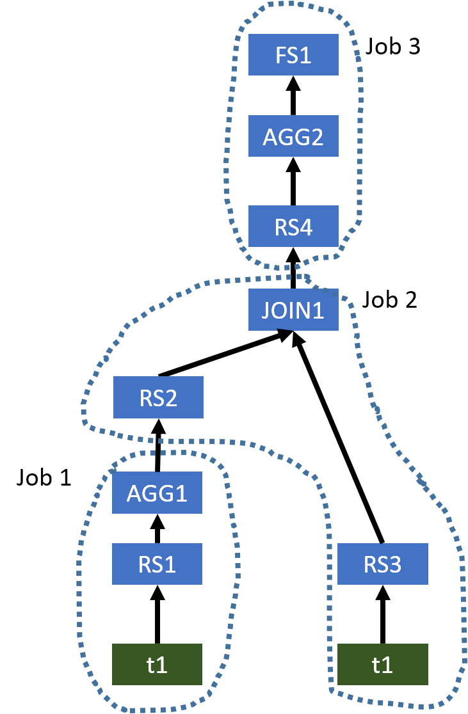
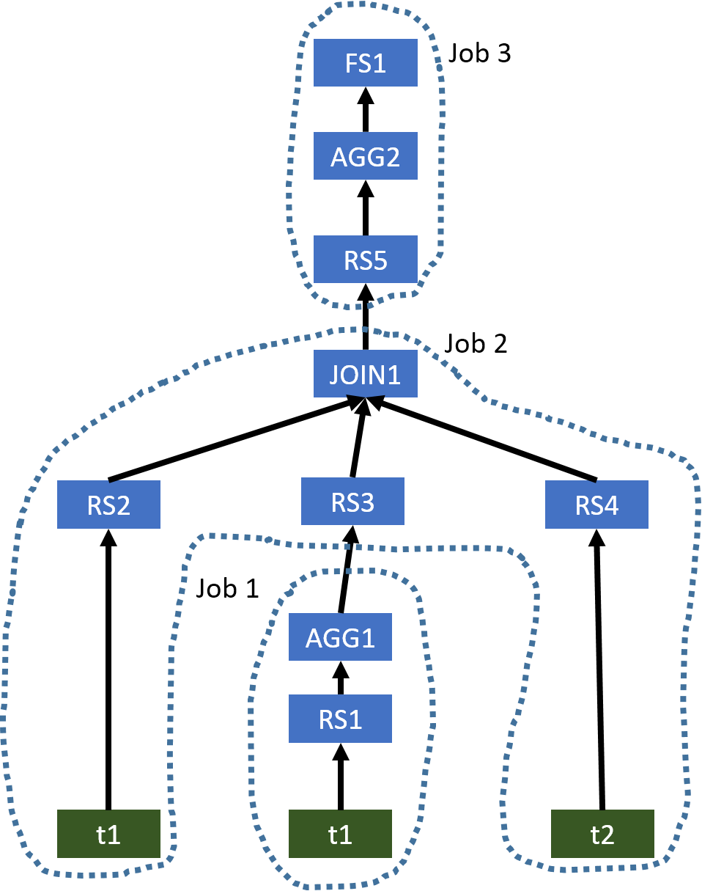
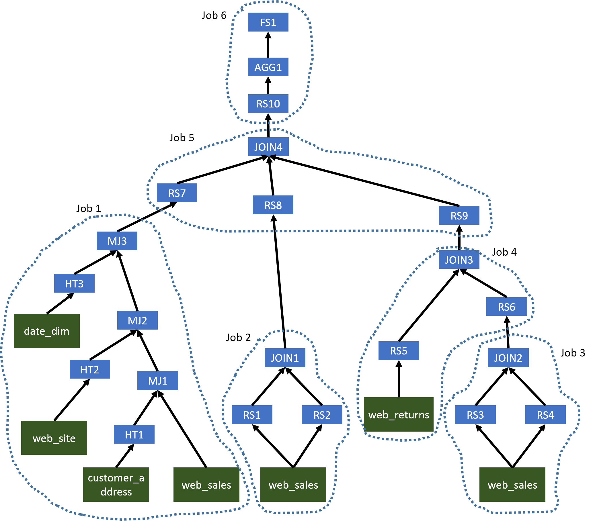
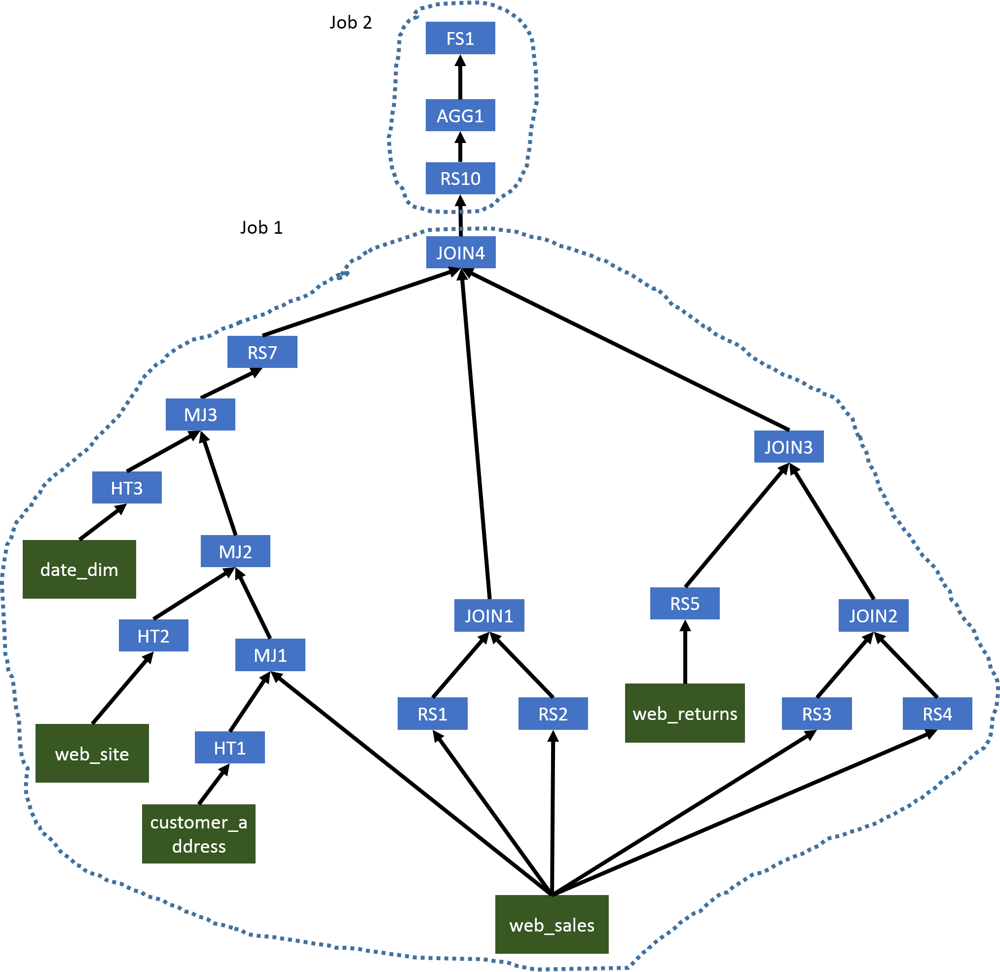

# Correlation Optimizer

[TOC]

> This page documents Correlation Optimizer. It was originally introduced by [HIVE-2206](https://issues.apache.org/jira/browse/HIVE-2206) and based on the idea of YSmart [1]. To turn on this optimizer, you can use ...

使用如下命令启用这个优化器：

	set hive.optimize.correlation=true;

## 1、Overview

> In Hadoop environments, an SQL query submitted to Hive will be evaluated in distributed systems. Thus, after generating a query operator tree representing the submitted SQL query, Hive needs to determine what operations can be executed in a task which will be evalauted in a single node. Also, since a MapReduce job can shuffle data data once, Hive also needs to cut the tree to multiple MapReduce jobs. It is important to cut an operator tree to multiple MapReduce in a good way, so the generated plan can evaluate the query efficiently.

在 Hadoop 环境中，提交到 Hive 的 SQL 查询将在分布式系统中评估。

因此，在生成一个表示已提交的 SQL 查询的查询操作符树之后，Hive 需要确定哪些操作可以在一个任务中执行，这些任务将在单个节点中评估。

此外，由于一个 MapReduce job 可以 shuffle 一次数据，Hive 也需要将树切割成多个 MapReduce jobs。以一种好的方式将一个操作符树切割成多个 MapReduce 是很重要的，这样生成的计划可以有效地评估查询。

> When generating an operator tree for a given SQL query, Hive identifies when to shuffle the data through operations which may need to shuffle data. For example, a JOIN operation may need to shuffle the input data if input tables have not been distributed by join columns. However, in a complex query, it is possible that the input data of an operation which may need to shuffle the input data has already been partitioned in the desired way. 

当为一个给定的 SQL 查询生成操作符树时，Hive 通过可能需要 shuffle 数据的操作来识别什么时候 shuffle 数据。

例如，如果输入表没有按 join 列分布，JOIN 操作可能需要 shuffle 输入数据。

然而，在一个复杂的查询中，可能需要 shuffle 输入数据的操作的输入数据已经按照所需的方式进行了分区。

> For example, it is possible we can have a query like `SELECT t1.key, sum(value) FROM t1 JOIN t2 ON (t1.key = t2.key) GROUP BY t1.key`. In this example, both JOIN operation and GROUP BY operation may need to shuffle the input data. However, because the output of JOIN operation is the input of GROUP BY operation and it has been already partitioned by t1.key, we do not need to shuffle the data for GROUP BY operation. However, Hive is not aware this correlation between JOIN operation and GROUP BY operation and thus it will generate two separate MapReduce jobs to evaluate this query. Basically, we unnecessarily shuffle the data for GROUP BY operation. In a more complex query, correlation-unaware query planning can generate a very inefficient execution plan and result in poor performance.

例如，`SELECT t1.key, sum(value) FROM t1 JOIN t2 ON (t1.key = t2.key) GROUP BY t1.key` 查询。

**在本例中，JOIN 操作和 GROUP BY 操作都可能需要 shuffle 输入数据。但是，因为 JOIN 操作的输出是 GROUP BY 操作的输入，并且它已经按 t1.key 分区了，我们就不需要为 GROUP BY 操作 shuffle 数据**。

**但是 Hive 不知道 JOIN 操作和 GROUP BY 操作之间的这种关联，因此会生成两个独立的 MapReduce jobs 来评估这个查询**。

基本上，我们不必要为 GROUP BY 操作 shuffle 数据。在更复杂的查询中，不考虑关联性的查询计划可能会生成非常低效的执行计划，并导致性能低下。

> Before we integrating Correlation Optimizer into Hive, Hive has ReduceSink Deduplication Optimizer which can figure out if we need to shuffle data for chained operators. However, to support more complex operator trees, we need a more general-purpose optimizer and a mechanism to correctly execute optimized plan. Thus, we have designed and implemented Correlation Optimizer and two operators for evaluating optimized plans. It is worth noting that it is better to use ReduceSink Deduplication Optimizer to handle simple cases first and then use Correlation Optimizer to handle more complex cases.

在我们将 Correlation Optimizer 集成到 Hive 之前，Hive 已经有了 ReduceSink Deduplication Optimizer，它可以判断出我们是否需要为链式操作符 shuffle 数据。

然而，为了支持更复杂的操作符树，我们需要一个更通用的优化器和一种正确执行优化计划的机制。

因此，我们设计并实现了 Correlation Optimizer 和两个操作符来评估优化方案。

值得注意的是，最好先使用 ReduceSink Deduplication Optimizer 处理简单的情况，然后使用 Correlation Optimizer 处理更复杂的情况。

## 2、Examples

> At first, let's take a look at three examples. For every query, we show the original operator tree generated by Hive and the optimized operator tree. To be concise, we only show the following operators, which are FileSinkOperator (FS), GroupByOperator (AGG), HashTableSinkOperator (HT), JoinOperator (JOIN), MapJoinOperator (MJ), and ReduceSinkOperator (RS). Also, in every query, we add comments (e.g. /*JOIN1*/) to indicate the node in the operator tree that an operation belongs to.

首先，让我们看三个例子。

对于每个查询，我们显示了 Hive 生成的原始操作符树和优化后的操作符树。为了简洁起见，我们只展示了以下操作符，它们是：

- FileSinkOperator (FS)
- GroupByOperator (AGG)
- HashTableSinkOperator (HT)
- JoinOperator (JOIN)
- MapJoinOperator (MJ)
- ReduceSinkOperator (RS)。

同样，在每个查询中，我们都添加注释(例如/*JOIN1*/)，以指示操作所属的操作符树中的节点。

### 2.1、Example 1

```sql
SELECT tmp1.key, count(*)
FROM (SELECT key, avg(value) AS avg
      FROM t1
      GROUP BY /*AGG1*/ key) tmp1
JOIN /*JOIN1*/ t1 ON (tmp1.key = t2.key)
WHERE t1.value > tmp1.avg
GROUP BY /*AGG2*/ tmp1.key;
```

> The original operator tree generated by Hive is shown below.

Hive 生成的原始的操作符树如下所示：



Figure 1: The original operator tree of Example 1 generated by Hive

> This plan uses three MapReduce jobs to evaluate this query. However, AGG1, JOIN1, and AGG2 all require the column key to be the partitioning column for shuffling the data. Thus, we do not need to shuffle the data in the same way three times. We only need to shuffle the data once, and thus a single MapReduce job is needed. The optimized operator tree is shown below.

该计划使用三个 MapReduce jobs 来评估该查询。但是，AGG1、JOIN1 和 AGG2 都要求列 key 作为对数据进行 shuffle 的分区列。

因此，我们不需要三次以同样的方式 shuffle 数据。我们只需要 shuffle 一次数据，因此需要一个单独的 MapReduce job。优化后的操作符树如下所示。


Figure 2: The optimized operator tree of Example 1

> Since the input table of AGG1 and the left table of JOIN1 are both t1, when we use a single MapReduce job to evaluate this query, Hive only needs to scan t1 once. While, in the original plan, t1 is used in two MapReduce jobs, and thus it is scanned twice.

由于 AGG1 的输入表和 JOIN1 的左表都是 t1，所以当我们使用单个 MapReduce job 来计算这个查询时，Hive 只需要扫描 t1 一次。而在原计划中，两个 MapReduce job 使用 t1，因此需要扫描两次。

### 2.2、Example 2

```sql
SELECT tmp1.key, count(*)
FROM t1
JOIN /*JOIN1*/ (SELECT key, avg(value) AS avg
                FROM t1
                GROUP BY /*AGG1*/ key) tmp1 ON (t1.key = tmp1.key)
JOIN /*JOIN1*/ t2 ON (tmp1.key = t2.key)
WHERE t2.value > tmp1.avg
GROUP BY /*AGG2*/ t1.key;
```

> The original operator tree generated by Hive is shown below.

Hive 生成的原始的操作符树如下所示：



Figure 3: The original operator tree of Example 2 generated by Hive

> This example is similar to Example 1. The optimized operator tree only needs a single MapReduce job, which is shown below.

本例类似 Example 1。优化后的操作符树仅需要一个 MapReduce job，如下所示。


Figure 4: The optimized operator tree of Example 2

### 2.3、Example 3

```sql
SELECT count(distinct ws1.ws_order_number) as order_count,
       sum(ws1.ws_ext_ship_cost) as total_shipping_cost,
       sum(ws1.ws_net_profit) as total_net_profit
FROM web_sales ws1
JOIN /*MJ1*/ customer_address ca ON (ws1.ws_ship_addr_sk = ca.ca_address_sk)
JOIN /*MJ2*/ web_site s ON (ws1.ws_web_site_sk = s.web_site_sk)
JOIN /*MJ3*/ date_dim d ON (ws1.ws_ship_date_sk = d.d_date_sk)
LEFT SEMI JOIN /*JOIN4*/ (SELECT ws2.ws_order_number as ws_order_number
                          FROM web_sales ws2 JOIN /*JOIN1*/ web_sales ws3
                          ON (ws2.ws_order_number = ws3.ws_order_number)
                          WHERE ws2.ws_warehouse_sk <> ws3.ws_warehouse_sk) ws_wh1
ON (ws1.ws_order_number = ws_wh1.ws_order_number)
LEFT SEMI JOIN /*JOIN4*/ (SELECT wr_order_number
                          FROM web_returns wr
                          JOIN /*JOIN3*/ (SELECT ws4.ws_order_number as ws_order_number
                                          FROM web_sales ws4 JOIN /*JOIN2*/ web_sales ws5
                                          ON (ws4.ws_order_number = ws5.ws_order_number)
                                          WHERE ws4.ws_warehouse_sk <> ws5.ws_warehouse_sk) ws_wh2
                          ON (wr.wr_order_number = ws_wh2.ws_order_number)) tmp1
ON (ws1.ws_order_number = tmp1.wr_order_number)
WHERE d.d_date >= '2001-05-01' and
      d.d_date <= '2001-06-30' and
      ca.ca_state = 'NC' and
      s.web_company_name = 'pri';
```

> The original operator tree generated by Hive is shown below.

Hive 生成的原始的操作符树如下所示：



Figure 5: The original operator tree of Example 3 generated by Hive

> In this complex query, we will first have several MapJoins (MJ1, MJ2, and MJ3) which can be evaluated in the same Map phase. Since JOIN1, JOIN2, JOIN3, and JOIN4 use the same column as the join key, we can use a single MapReduce job to evaluate all operators before AGG1. The second MapReduce job will generate the final results. The optimized operator tree is shown below.

在这个复杂的查询中，我们首先将有多个 MapJoins (MJ1、MJ2和MJ3)，它们可以在同一个 Map 阶段进行计算。

由于JOIN1、JOIN2、JOIN3 和 JOIN4 使用相同的列作为连接键，我们可以使用一个 MapReduce job 来评估 AGG1 之前的所有操作符。第二次 MapReduce job 将生成最终结果。优化后的操作符树如下所示。



Figure 6: The optimized operator tree of Example 3

## 3、Intra-query Correlations

> In Hive, a submitted SQL query needs to be evaluated in a distributed system. When evaluating a query, data may need to shuffled sometimes. Based on the nature of different data operations, operators in Hive can be divided to two categories.

在 Hive 中，提交的 SQL 查询需要在分布式系统中进行评估。

在评估一个查询时，有时可能需要对数据进行 shuffle。

根据不同数据操作的性质，Hive 中的操作符可以分为两类。

> Operators which do not require data shuffling. Examples are TableScanOperator, SelectOperator and FilterOperator.

- 不需要数据 shuffle 的操作符。例如 TableScanOperator、SelectOperator 和 FilterOperator。

> Operators which require data shuffling. Examples are GroupByOperator and JoinOperator.

- 需要数据 shuffle 的操作符。例如 GroupByOperator 和 JoinOperator。

> For an operator requiring data shuffling, Hive will add one or multiple ReduceSinkOperators as parents of this operator (the number of ReduceSinkOperators depends on the number of inputs of the operator requiring data shuffling). Those ReduceSinkOperators form the boundary between the Map phase and Reduce phase. Then, Hive will cut the operator tree to multiple pieces (MapReduce tasks) and each piece can be executed in a MapReduce job.

对于一个需要数据 shuffle 的操作，Hive 会添加一个或多个 ReduceSinkOperators 作为该操作的父操作（ReduceSinkOperators 的数量取决于需要数据 shuffle 的操作的输入的数量）。

这些 ReduceSinkOperators 形成了 Map 阶段和 Reduce 阶段之间的边界。然后，Hive 会将操作符树切割成多个块（MapReduce 任务），每一个块都可以在一个  MapReduce job 中执行。

> For a complex query, it is possible that a input table is used by multiple MapReduce tasks. In this case, this table will be loaded multiple times when the original operator tree is used. Also, when generating those ReduceSinkOperators, Hive does not consider if the corresponding operator requiring data shuffling really needs a re-partitioned input data. For example, in the original operator tree of [Example 1](https://cwiki.apache.org/confluence/display/Hive/Correlation+Optimizer#CorrelationOptimizer-example1) ([Figure 1](https://cwiki.apache.org/confluence/display/Hive/Correlation+Optimizer#CorrelationOptimizer-figure1)), AGG1, JOIN1, and AGG2 require the data been shuffled in the same way because all of them require the column key to be the partitioning column in their corresponding ReduceSinkOperators. But, Hive is not aware this correlation between AGG1, JOIN1, and AGG2, and still generates three MapReduce tasks.

对于一个复杂的查询，一个输入表可能会被多个 MapReduce 任务使用。在这种情况下，当使用原始的操作符树时，这个表将被加载多次。

此外，Hive 在生成这些 ReduceSinkOperators 时，并不会考虑需要数据 shuffle 的对应的操作符是否真的需要重新划分输入数据。

例如，在示例1(图1)的原始操作符树中，AGG1、JOIN1 和 AGG2 要求以相同的方式对数据进行 shuffle，因为它们都要求列 key 作为它们对应的 ReduceSinkOperators 中的分区列。但是，Hive并没有意识到 AGG1、JOIN1 和 AGG2 间的这种关联，仍然生成三个 MapReduce 任务。

> Correlation Optimizer aims to exploit two intra-qeury correlations mentioned above.

Correlation Optimizer 的目标是利用上面提到的两个查询内的相关性。

> Input Correlation: A input table is used by multiple MapReduce tasks in the original operator tree.

- 输入关联：一个输入表被原始操作树中的多个 MapReduce 任务使用。

> Job Flow Correlation: Two dependent MapReduce tasks shuffle the data in the same way.

- 作业流关联:两个相互依赖的 MapReduce 任务以相同的方式 shuffle 数据。

## 4、Correlation Detection

> In Hive, every query has one or multiple terminal operators which are the last operators in the operator tree. Those terminal operators are called FileSinkOperatos. To give an easy explanation, if an operator A is on another operator B's path to a FileSinkOperato, A is the downstream of B and B is the upstream of A.

在 Hive 中，每个查询都有一个或多个终端操作符，终端操作符是操作符树中的最后一个操作符。

这些终端操作符被称为 FileSinkOperatos。简单的解释一下，如果一个操作符 A 在另一个操作符 B 的 FileSinkOperato 路径上，A 是 B 的下游，B 是 A 的上游。

> For a given operator tree like the one shown in [Figure 1](https://cwiki.apache.org/confluence/display/Hive/Correlation+Optimizer#CorrelationOptimizer-figure1), the Correlation Optimizer starts to visit operators in the tree from those FileSinkOperatos in a depth-first way. The tree walker stops at every ReduceSinkOperator. Then, a correlation detector starts to find a correlation from this ReduceSinkOperator and its siblings by finding the furthest correlated upstream ReduceSinkOperators in a recursive way. If we can find any correlated upstream ReduceSinkOperator, we find a correlation. Currently, there are three conditions to determine if a upstream ReduceSinkOperator and an downstream ReduceSinkOperator are correlated, which are

对于一个给定的操作符树，如图 1 所示，Correlation Optimizer 开始以深度优先的方式访问来自这些 FileSinkOperatos 的树中的操作符。

树行者在每个 ReduceSinkOperator 上都停下来。然后，相关检测器开始以递归的方式，通过找到最大相关的上游 ReduceSinkOperators 来从这个 ReduceSinkOperators 和它的兄弟姐妹中找到相关性。

如果我们能找到任何相关的上游的 ReduceSinkOperator，我们就找到一个相关性。目前，判断上游 ReduceSinkOperator 与下游 ReduceSinkOperator 是否相关的条件有三种：

- 来自这两个 ReduceSinkOperators 发出的行以相同的方式排序；

- 来自这两个 ReduceSinkOperators 发出的行以相同的方式分区；和

- 这些 ReduceSinkOperators 在数字 reducers 上没有任何冲突。

> emitted rows from these two ReduceSinkOperators are sorted in the same way;
> emitted rows from these two ReduceSinkOperators are partitioned in the same way; and
> these ReduceSinkOperators do not have any conflict on the number reducers.

> Interested readers may refer to our [implementation](https://svn.apache.org/viewvc/hive/trunk/ql/src/java/org/apache/hadoop/hive/ql/optimizer/correlation/CorrelationOptimizer.java?view=log) for details.

感兴趣的读者可以参考我们的实现来了解细节。

> During the correlation detection, a JoinOperator or a UnionOperator can introduce branches to the searching path. For a JoinOperator, its parents are all ReduceSinkOperators. When the detector reaches a JoinOperator, it will check if all parents of this JoinOperator are correlated to the downstream ReduceSinkOperator. Because a JoinOperator contains one or multiple 2-way Join operations, for a ReduceSinkOperator, we can determine if another ReduceSinkOperator appearing in the same Join operation is correlated based on the Join type and positions of these ReduceSinkOperators in the Join operation with the following two rules.

在相关性检测期间，JoinOperator 或 UnionOperator 可以向搜索路径引入分支。

对于 JoinOperator，它的父都是 ReduceSinkOperators。当检测器到达一个 JoinOperator 时，它将检查这个 JoinOperator 的所有父是否与下游的 ReduceSinkOperator 相关。

因为一个 JoinOperator 包含一个或多个双向 Join 操作，对于一个 ReduceSinkOperator，我们可以确定出现在相同的连接操作中的另一个 ReduceSinkOperator 是相关的，基于 Join 类型和具有如下两个规则的 Join 操作中的这些 ReduceSinkOperators 的位置。

> If a ReduceSinkOperator represents the left table of a INNER JOIN, a LEFT OUTER JOIN, or a LEFT SEMI JOIN, the ReduceSinkOperator representing the right table is also considered correlated; and

- 如果 ReduceSinkOperator 表示 INNER JOIN、LEFT OUTER JOIN 或 LEFT SEMI JOIN 的左表，则表示右表的 ReduceSinkOperator 也被认为是相关的；和

> If a ReduceSinkOperator represents the right table of a INNER JOIN, or a RIGHT OUTER JOIN, the ReduceSinkOperator representing the left table is also considered correlated.

- 如果 ReduceSinkOperator 表示 INNER JOIN，或 RIGHT OUTER JOIN 的右表，则表示左表的 ReduceSinkOperator 也被认为是相关的。

> With these two rules, we start to analyze those parent ReduceSinkOperators of the JoinOperator from every ReduceSinkOperator which has columns appearing in the join clause and then we can find all correlated ReduceSinkOperators recursively. If we can find that all parent ReduceSinkOperators are correlated from every ReduceSinkOperator which has columns appearing in the join clause, we will continue the correlation detection on this branch. Otherwise, we will determine that none of ReduceSinkOperator for the JoinOperator is correlated and stop the correlation detection on this branch.

根据这两个规则，我们从每个在 join 子句中出现的列的 ReduceSinkOperator 中开始分析 JoinOperator 的父 ReduceSinkOperator，

然后我们可以递归地找到所有相关的 ReduceSinkOperator。

如果我们能发现所有的父 ReduceSinkOperators 都与每个在 join 子句中出现的列的 ReduceSinkOperators 相关，我们将继续在这个分支上进行相关检测。

否则，我们将确定 JoinOperator 的 ReduceSinkOperator 中没有一个是相关的，并停止这个分支上的相关检测。

> For a UnionOperator, none of its parents will be a ReduceSinkOperator. So, we check if we can find correlated ReduceSinkOperators for every parent branch of this UnionOperator. If any branch does not have a ReduceSinkOperator, we will determine that we do not find any correlated ReduceSinkOperator at parent branches of this UnionOperator.

对于 UnionOperator，它的父都不是 ReduceSinkOperator。

因此，我们检查是否可以为这个 UnionOperator 的每个父分支找到相关的 ReduceSinkOperators。

如果任何分支没有 ReduceSinkOperator，我们将确定在 UnionOperator 的父分支上没有找到任何相关的 ReduceSinkOperator。

> During the process of correlation detection, it is possible that the detector can visit a JoinOperator which will be converted to a Map Join later. In this case, the detector stops searching the branch containing this Map Join. For example, in [Figure 5](https://cwiki.apache.org/confluence/display/Hive/Correlation+Optimizer#CorrelationOptimizer-figure5), the detector knows that MJ1, MJ2, and MJ3 will be converted to Map Joins.

在关联检测过程中，检测器可能会访问一个 JoinOperator，这个 JoinOperator 稍后将被转换为 Map Join。在这种情况下，检测器将停止搜索包含此 Map Join 的分支。例如，在图 5 中，检测器知道 MJ1、MJ2 和 MJ3 将被转换为 Map Joins。

## 5、Operator Tree Transformation

> In a correlation, there are two kinds of ReduceSinkOperators. The first kinds of ReduceSinkOperators are at the bottom layer of a query operator tree which are needed to emit rows to the shuffling phase. For example, in [Figure 1](https://cwiki.apache.org/confluence/display/Hive/Correlation+Optimizer#CorrelationOptimizer-figure1), RS1 and RS3 are bottom layer ReduceSinkOperators. The second kinds of ReduceSinkOperators are unnecessary ones which can be removed from the optimized operator tree. For example, in Figure 1, RS2 and RS4 are unnecessary ReduceSinkOperators. Because the input rows of the Reduce phase may need to be forwarded to different operators and those input rows are coming from a single stream, we add a new operator called DemuxOperator to dispatch input rows of the Reduce phase to corresponding operators. 

在一个关联中，有 ReduceSinkOperators 的两种类型。

第一类位于查询操作符树的底层，用于将行发送到 shuffle 阶段。例如，在图1中，RS1 和 RS3 是底层 ReduceSinkOperators。

第二类是不必要的，可以从优化的操作符树中删除。例如，在图1中，RS2 和 RS4 是不必要的 ReduceSinkOperators。

由于 Reduce 阶段的输入行可能需要转发给不同的操作符，而且这些输入行来自单个流，因此我们添加了一个名为 DemuxOperator 的新操作符，以将 Reduce 阶段的输入行分派给相应的操作符。

> In the operator tree transformation, we first connect children of those bottom layer ReduceSinkOperators to the DemuxOperator and reassign tags of those bottom layer ReduceSinkOperators (the DemuxOperator is the only child of those bottom layer ReduceSinkOperators). In the DemuxOperator, we record two mappings. The first one is called newTagToOldTag which maps those new tags assigned to those bottom layer ReduceSinkOperators to their original tags. Those original tags are needed to make JoinOperator work correctly. The second mapping is called newTagToChildIndex which maps those new tags to the children indexes. With this mapping, the DemuxOperator can know the correct operator that a row needs to be forwarded based on the tag of this row. 

在操作符树变换中，我们首先将这些底层 ReduceSinkOperators 的子操作连接到 DemuxOperator，并重新分配这些底层 ReduceSinkOperators 的标签(DemuxOperator 是这些底层 ReduceSinkOperators 的唯一子操作)。

在 DemuxOperator 中，我们记录两个映射。第一个叫做 newTagToOldTag，它将分配给底层 ReduceSinkOperators 的新标签映射到它们的原始标签。为了使 JoinOperator 正确工作，需要这些原始标签。

第二个映射称为 newTagToChildIndex，它将这些新标签映射到子索引。通过这个映射，DemuxOperator 可以根据一行的标签知道需要转发行的正确操作符。

> The second step of operator tree transformation is to remove those unnecessary ReduceSinkOperators. To make the operator tree in the Reduce phase work correctly, we add a new operator called MuxOperator to the original place of those unnecessary ReduceSinkOperators. It is worth noting that if an operator has multiple unnecessary ReduceSinkOperators as its parents, we only add a single MuxOperator.

操作符树转换的第二步是删除那些不必要的 ReduceSinkOperators。

为了使 Reduce 阶段的操作符树正确工作，我们在那些不必要的 ReduceSinkOperators 的原始位置添加了一个名为 MuxOperator 的新操作符。

值得注意的是，如果一个操作符有多个不必要的 ReduceSinkOperators 作为它的父操作符，我们只添加一个 MuxOperator。

## 6、Executing Optimized Operator Tree in the Reduce Phase

> In the Reduce phase, the ExecReducer will forward all reduce input rows to DemuxOperator first. Currently, blocking operators in the reduce phase operator tree share the same keys. Other cases will be supported in future work. Then, DemuxOperator will forward rows to their corresponding operators. Because a Reduce plan optimized Correlation Optimizer can be a tree structure, we need to coordinate operators in this tree to make the Reduce phase work correctly. This coordination mechanism is implemented in ExecDriver, DemuxOperator and MuxOperator.

在 Reduce 阶段，ExecReducer 首先将所有 Reduce 输入行转发给 DemuxOperator。

目前，在 reduce 阶段的操作符树中的阻塞操作符共享相同的键。其他情况将在今后的工作中得到支持。

然后，DemuxOperator 将行转发给它们对应的操作符。因为一个 Correlation Optimizer 优化的 Reduce 计划可以是一个树形结构，我们需要协调这棵树中的操作符，使 Reduce 阶段正确地工作。

这种协调机制在 ExecDriver、DemuxOperator 和 MuxOperator 中实现。

> When a new row is sent to the ExecDriver, it checks if it needs to start a new group of rows by checking values of those key columns. If a new group of rows is coming, it first invokes DemuxOperator.endGroup. Then, the DemuxOperator will ask its children to process their buffered rows and propagate the endGroup call to the operator tree. Finally, DemuxOperator will propagate processGroup call to the operator tree. Usually, the implementation of processGroup in an operator only propagates this call to its children. MuxOperator is the one that overrides processGroup. When a MuxOperator gets the processGroup call, it check if all its parent operators have invoked this call. If so, it will ask its child to generate results and propagate processGroup to its child. Once the processGroup has been propagated to all operators, the DemuxOperator.endGroup will return and ExecDriver will propagate startGroup to the operator tree.

当一个新行被发送给 ExecDriver 时，它通过检查那些 key 列的值，来检查它是否需要启动一个新的行组。

如果来了一个新的行组，它首先调用 `DemuxOperator.endGroup`。然后，DemuxOperator 将要求其子程序处理它们的缓冲行，并将 endGroup 调用传播到操作符树。最后，DemuxOperator 将 processGroup 调用传播到操作符树。

通常，操作符中的 processGroup 实现只将此调用传播给它的子操作符。MuxOperator 是覆盖 processGroup 的。当 MuxOperator 获得 processGroup 调用时，它检查它的所有父操作符是否都调用了这个调用。

如果是，它将要求它的子程序生成结果并将 processGroup 传播给它的子程序。一旦 processGroup 被传播到所有操作符，`DemuxOperator.endGroup` 将返回，ExecDriver 将把 startGroup 传播到操作符树。

> For every row sent to the ExecDriver, it also has a tag assigned by a corresponding RediceSinkOperator at the Map phase. In a row group (rows having the same key), rows are also sorted by their tags. When the DemuxOperator sees a new tag coming, it knows all child operators associated with tags smaller than this new coming tag will not have any input within the current row group. Thus, it can call endGroup and processGroup of those operators earlier. With this logic, within a row group, the input rows of every operator in the operator tree are also ordered by tags, which is required by JoinOperator. This logic also makes rows in the buffer of an operator be emitted as quickly as possible, which avoids unnecessary memory footprint contributed from buffering unnecessary rows.

对于发送到 ExecDriver 的每一行，它还具有一个由对应的 RediceSinkOperator 在 Map 阶段分配的标签。

在一个行组(具有相同键的行)中，行也按其标签排序。当 DemuxOperator 看到一个新标签到来时，它知道所有与比这个新标签小的标签相关联的子操作符在当前行组中不会有任何输入。

因此，它可以在前面调用这些操作符的 endGroup 和 processGroup。使用此逻辑，在一个行组中，操作符树中每个操作符的输入行也按标签排序，这是 JoinOperator 所需要的。

这种逻辑还使操作符缓冲区中的行尽可能快地发出，从而避免了由于缓冲不必要的行而造成的不必要的内存占用。

## 7、Related Jiras

The umbrella jira is [HIVE-3667](https://issues.apache.org/jira/browse/HIVE-3667).

### 7.1、Resolved Jiras

- [HIVE-1772](https://issues.apache.org/jira/browse/HIVE-1772)
- [HIVE-2206](https://issues.apache.org/jira/browse/HIVE-2206)
- [HIVE-3430](https://issues.apache.org/jira/browse/HIVE-3430)
- [HIVE-3670](https://issues.apache.org/jira/browse/HIVE-3670)
- [HIVE-3671](https://issues.apache.org/jira/browse/HIVE-3671)
- [HIVE-4952](https://issues.apache.org/jira/browse/HIVE-4952)
- [HIVE-4972](https://issues.apache.org/jira/browse/HIVE-4972)

### 7.2、Unresolved Jiras

- [HIVE-3668](https://issues.apache.org/jira/browse/HIVE-3668)
- [HIVE-3669](https://issues.apache.org/jira/browse/HIVE-3669)
- [HIVE-3773](https://issues.apache.org/jira/browse/HIVE-3773)
- [HIVE-4751](https://issues.apache.org/jira/browse/HIVE-4751)

## 8、References

Rubao Lee, Tian Luo, Yin Huai, Fusheng Wang, Yongqiang He, Xiaodong Zhang. [YSmart: Yet another SQL-to-MapReduce Translator](http://www.cse.ohio-state.edu/hpcs/WWW/HTML/publications/papers/TR-11-7.pdf), ICDCS, 2011
