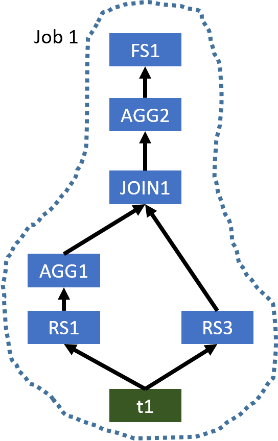

# Correlation Optimizer

[TOC]

> This page documents Correlation Optimizer. It was originally introduced by [HIVE-2206](https://issues.apache.org/jira/browse/HIVE-2206) and based on the idea of YSmart [1]. To turn on this optimizer, you can use ...

使用如下命令启用这个优化器：

	set hive.optimize.correlation=true;

## 1、Overview

> In Hadoop environments, an SQL query submitted to Hive will be evaluated in distributed systems. Thus, after generating a query operator tree representing the submitted SQL query, Hive needs to determine what operations can be executed in a task which will be evalauted in a single node. Also, since a MapReduce job can shuffle data data once, Hive also needs to cut the tree to multiple MapReduce jobs. It is important to cut an operator tree to multiple MapReduce in a good way, so the generated plan can evaluate the query efficiently.

在 Hadoop 环境中，提交到 Hive 的 SQL 查询将在分布式系统中评估。

因此，在生成一个表示已提交的 SQL 查询的查询操作符树之后，Hive 需要确定哪些操作可以在一个任务中执行，这些任务将在单个节点中评估。

此外，由于一个 MapReduce job 可以 shuffle 一次数据，Hive 也需要将树切割成多个 MapReduce jobs。以一种好的方式将一个操作符树切割成多个 MapReduce 是很重要的，这样生成的计划可以有效地评估查询。

> When generating an operator tree for a given SQL query, Hive identifies when to shuffle the data through operations which may need to shuffle data. For example, a JOIN operation may need to shuffle the input data if input tables have not been distributed by join columns. However, in a complex query, it is possible that the input data of an operation which may need to shuffle the input data has already been partitioned in the desired way. 

当为一个给定的 SQL 查询生成操作符树时，Hive 通过可能需要 shuffle 数据的操作来识别什么时候 shuffle 数据。

例如，如果输入表没有按 join 列分布，JOIN 操作可能需要 shuffle 输入数据。

然而，在一个复杂的查询中，可能需要 shuffle 输入数据的操作的输入数据已经按照所需的方式进行了分区。

> For example, it is possible we can have a query like `SELECT t1.key, sum(value) FROM t1 JOIN t2 ON (t1.key = t2.key) GROUP BY t1.key`. In this example, both JOIN operation and GROUP BY operation may need to shuffle the input data. However, because the output of JOIN operation is the input of GROUP BY operation and it has been already partitioned by t1.key, we do not need to shuffle the data for GROUP BY operation. However, Hive is not aware this correlation between JOIN operation and GROUP BY operation and thus it will generate two separate MapReduce jobs to evaluate this query. Basically, we unnecessarily shuffle the data for GROUP BY operation. In a more complex query, correlation-unaware query planning can generate a very inefficient execution plan and result in poor performance.

例如，`SELECT t1.key, sum(value) FROM t1 JOIN t2 ON (t1.key = t2.key) GROUP BY t1.key` 查询。

**在本例中，JOIN 操作和 GROUP BY 操作都可能需要 shuffle 输入数据。但是，因为 JOIN 操作的输出是 GROUP BY 操作的输入，并且它已经按 t1.key 分区了，我们就不需要为 GROUP BY 操作 shuffle 数据**。

**但是 Hive 不知道 JOIN 操作和 GROUP BY 操作之间的这种关联，因此会生成两个独立的 MapReduce jobs 来评估这个查询**。

基本上，我们不必要为 GROUP BY 操作 shuffle 数据。在更复杂的查询中，不考虑关联性的查询计划可能会生成非常低效的执行计划，并导致性能低下。

> Before we integrating Correlation Optimizer into Hive, Hive has ReduceSink Deduplication Optimizer which can figure out if we need to shuffle data for chained operators. However, to support more complex operator trees, we need a more general-purpose optimizer and a mechanism to correctly execute optimized plan. Thus, we have designed and implemented Correlation Optimizer and two operators for evaluating optimized plans. It is worth noting that it is better to use ReduceSink Deduplication Optimizer to handle simple cases first and then use Correlation Optimizer to handle more complex cases.

在我们将 Correlation Optimizer 集成到 Hive 之前，Hive 已经有了 ReduceSink Deduplication Optimizer，它可以判断出我们是否需要为链式操作符 shuffle 数据。

然而，为了支持更复杂的操作符树，我们需要一个更通用的优化器和一种正确执行优化计划的机制。

因此，我们设计并实现了 Correlation Optimizer 和两个操作符来评估优化方案。

值得注意的是，最好先使用 ReduceSink Deduplication Optimizer 处理简单的情况，然后使用 Correlation Optimizer 处理更复杂的情况。

## 2、Examples

> At first, let's take a look at three examples. For every query, we show the original operator tree generated by Hive and the optimized operator tree. To be concise, we only show the following operators, which are FileSinkOperator (FS), GroupByOperator (AGG), HashTableSinkOperator (HT), JoinOperator (JOIN), MapJoinOperator (MJ), and ReduceSinkOperator (RS). Also, in every query, we add comments (e.g. /*JOIN1*/) to indicate the node in the operator tree that an operation belongs to.

首先，让我们看三个例子。

对于每个查询，我们显示了 Hive 生成的原始操作符树和优化后的操作符树。为了简洁起见，我们只展示了以下操作符，它们是：

- FileSinkOperator (FS)
- GroupByOperator (AGG)
- HashTableSinkOperator (HT)
- JoinOperator (JOIN)
- MapJoinOperator (MJ)
- ReduceSinkOperator (RS)。

同样，在每个查询中，我们都添加注释(例如/*JOIN1*/)，以指示操作所属的操作符树中的节点。

### 2.1、Example 1

```sql
SELECT tmp1.key, count(*)
FROM (SELECT key, avg(value) AS avg
      FROM t1
      GROUP BY /*AGG1*/ key) tmp1
JOIN /*JOIN1*/ t1 ON (tmp1.key = t2.key)
WHERE t1.value > tmp1.avg
GROUP BY /*AGG2*/ tmp1.key;
```

> The original operator tree generated by Hive is shown below.

Hive 生成的原始的操作符树如下所示：


Figure 1: The original operator tree of Example 1 generated by Hive

> This plan uses three MapReduce jobs to evaluate this query. However, AGG1, JOIN1, and AGG2 all require the column key to be the partitioning column for shuffling the data. Thus, we do not need to shuffle the data in the same way three times. We only need to shuffle the data once, and thus a single MapReduce job is needed. The optimized operator tree is shown below.

该计划使用三个 MapReduce jobs 来评估该查询。但是，AGG1、JOIN1 和 AGG2 都要求列 key 作为对数据进行 shuffle 的分区列。

因此，我们不需要三次以同样的方式 shuffle 数据。我们只需要 shuffle 一次数据，因此需要一个单独的 MapReduce job。优化后的操作符树如下所示。



Figure 2: The optimized operator tree of Example 1

> Since the input table of AGG1 and the left table of JOIN1 are both t1, when we use a single MapReduce job to evaluate this query, Hive only needs to scan t1 once. While, in the original plan, t1 is used in two MapReduce jobs, and thus it is scanned twice.

由于 AGG1 的输入表和 JOIN1 的左表都是 t1，所以当我们使用单个 MapReduce job 来计算这个查询时，Hive 只需要扫描 t1 一次。而在原计划中，两个 MapReduce job 使用 t1，因此需要扫描两次。

### 2.2、Example 2

```sql
SELECT tmp1.key, count(*)
FROM t1
JOIN /*JOIN1*/ (SELECT key, avg(value) AS avg
                FROM t1
                GROUP BY /*AGG1*/ key) tmp1 ON (t1.key = tmp1.key)
JOIN /*JOIN1*/ t2 ON (tmp1.key = t2.key)
WHERE t2.value > tmp1.avg
GROUP BY /*AGG2*/ t1.key;
```

> The original operator tree generated by Hive is shown below.

Hive 生成的原始的操作符树如下所示：


Figure 3: The original operator tree of Example 2 generated by Hive

> This example is similar to Example 1. The optimized operator tree only needs a single MapReduce job, which is shown below.

本例类似 Example 1。优化后的操作符树仅需要一个 MapReduce job，如下所示。


Figure 4: The optimized operator tree of Example 2

### 2.3、Example 3

```sql
SELECT count(distinct ws1.ws_order_number) as order_count,
       sum(ws1.ws_ext_ship_cost) as total_shipping_cost,
       sum(ws1.ws_net_profit) as total_net_profit
FROM web_sales ws1
JOIN /*MJ1*/ customer_address ca ON (ws1.ws_ship_addr_sk = ca.ca_address_sk)
JOIN /*MJ2*/ web_site s ON (ws1.ws_web_site_sk = s.web_site_sk)
JOIN /*MJ3*/ date_dim d ON (ws1.ws_ship_date_sk = d.d_date_sk)
LEFT SEMI JOIN /*JOIN4*/ (SELECT ws2.ws_order_number as ws_order_number
                          FROM web_sales ws2 JOIN /*JOIN1*/ web_sales ws3
                          ON (ws2.ws_order_number = ws3.ws_order_number)
                          WHERE ws2.ws_warehouse_sk <> ws3.ws_warehouse_sk) ws_wh1
ON (ws1.ws_order_number = ws_wh1.ws_order_number)
LEFT SEMI JOIN /*JOIN4*/ (SELECT wr_order_number
                          FROM web_returns wr
                          JOIN /*JOIN3*/ (SELECT ws4.ws_order_number as ws_order_number
                                          FROM web_sales ws4 JOIN /*JOIN2*/ web_sales ws5
                                          ON (ws4.ws_order_number = ws5.ws_order_number)
                                          WHERE ws4.ws_warehouse_sk <> ws5.ws_warehouse_sk) ws_wh2
                          ON (wr.wr_order_number = ws_wh2.ws_order_number)) tmp1
ON (ws1.ws_order_number = tmp1.wr_order_number)
WHERE d.d_date >= '2001-05-01' and
      d.d_date <= '2001-06-30' and
      ca.ca_state = 'NC' and
      s.web_company_name = 'pri';
```

> The original operator tree generated by Hive is shown below.

Hive 生成的原始的操作符树如下所示：


Figure 5: The original operator tree of Example 3 generated by Hive

> In this complex query, we will first have several MapJoins (MJ1, MJ2, and MJ3) which can be evaluated in the same Map phase. Since JOIN1, JOIN2, JOIN3, and JOIN4 use the same column as the join key, we can use a single MapReduce job to evaluate all operators before AGG1. The second MapReduce job will generate the final results. The optimized operator tree is shown below.

在这个复杂的查询中，我们首先将有多个 MapJoins (MJ1、MJ2和MJ3)，它们可以在同一个 Map 阶段进行计算。

由于JOIN1、JOIN2、JOIN3 和 JOIN4 使用相同的列作为连接键，我们可以使用一个 MapReduce job 来评估 AGG1 之前的所有操作符。第二次 MapReduce job 将生成最终结果。优化后的操作符树如下所示。


Figure 6: The optimized operator tree of Example 3

## 3、Intra-query Correlations

> In Hive, a submitted SQL query needs to be evaluated in a distributed system. When evaluating a query, data may need to shuffled sometimes. Based on the nature of different data operations, operators in Hive can be divided to two categories.

在 Hive 中，提交的 SQL 查询需要在分布式系统中进行评估。

在评估一个查询时，有时可能需要对数据进行 shuffle。

根据不同数据操作的性质，Hive 中的操作符可以分为两类。

> Operators which do not require data shuffling. Examples are TableScanOperator, SelectOperator and FilterOperator.

- 不需要数据 shuffle 的操作符。例如 TableScanOperator、SelectOperator 和 FilterOperator。

> Operators which require data shuffling. Examples are GroupByOperator and JoinOperator.

- 需要数据 shuffle 的操作符。例如 GroupByOperator 和 JoinOperator。

> For an operator requiring data shuffling, Hive will add one or multiple ReduceSinkOperators as parents of this operator (the number of ReduceSinkOperators depends on the number of inputs of the operator requiring data shuffling). Those ReduceSinkOperators form the boundary between the Map phase and Reduce phase. Then, Hive will cut the operator tree to multiple pieces (MapReduce tasks) and each piece can be executed in a MapReduce job.

对于一个需要数据 shuffle 的操作，Hive 会添加一个或多个 ReduceSinkOperators 作为该操作的父操作（ReduceSinkOperators 的数量取决于需要数据 shuffle 的操作的输入的数量）。

这些 ReduceSinkOperators 形成了 Map 阶段和 Reduce 阶段之间的边界。然后，Hive 会将操作符树切割成多个块（MapReduce 任务），每一个块都可以在一个  MapReduce job 中执行。

> For a complex query, it is possible that a input table is used by multiple MapReduce tasks. In this case, this table will be loaded multiple times when the original operator tree is used. Also, when generating those ReduceSinkOperators, Hive does not consider if the corresponding operator requiring data shuffling really needs a re-partitioned input data. For example, in the original operator tree of [Example 1](https://cwiki.apache.org/confluence/display/Hive/Correlation+Optimizer#CorrelationOptimizer-example1) ([Figure 1](https://cwiki.apache.org/confluence/display/Hive/Correlation+Optimizer#CorrelationOptimizer-figure1)), AGG1, JOIN1, and AGG2 require the data been shuffled in the same way because all of them require the column key to be the partitioning column in their corresponding ReduceSinkOperators. But, Hive is not aware this correlation between AGG1, JOIN1, and AGG2, and still generates three MapReduce tasks.

对于一个复杂的查询，一个输入表可能会被多个 MapReduce 任务使用。在这种情况下，当使用原始的操作符树时，这个表将被加载多次。

此外，Hive 在生成这些 ReduceSinkOperators 时，并不会考虑需要数据 shuffle 的对应的操作符是否真的需要重新划分输入数据。

例如，在示例1(图1)的原始操作符树中，AGG1、JOIN1 和 AGG2 要求以相同的方式对数据进行 shuffle，因为它们都要求列 key 作为它们对应的 ReduceSinkOperators 中的分区列。但是，Hive并没有意识到 AGG1、JOIN1 和 AGG2 间的这种关联，仍然生成三个 MapReduce 任务。

> Correlation Optimizer aims to exploit two intra-qeury correlations mentioned above.

Correlation Optimizer 的目标是利用上面提到的两个查询内的相关性。

> Input Correlation: A input table is used by multiple MapReduce tasks in the original operator tree.

- 输入关联：一个输入表被原始操作树中的多个 MapReduce 任务使用。

> Job Flow Correlation: Two dependent MapReduce tasks shuffle the data in the same way.

- 作业流关联:两个相互依赖的 MapReduce 任务以相同的方式 shuffle 数据。

## 4、Correlation Detection


## 7、Related Jiras

The umbrella jira is [HIVE-3667](https://issues.apache.org/jira/browse/HIVE-3667).

### 7.1、Resolved Jiras

- [HIVE-1772](https://issues.apache.org/jira/browse/HIVE-1772)
- [HIVE-2206](https://issues.apache.org/jira/browse/HIVE-2206)
- [HIVE-3430](https://issues.apache.org/jira/browse/HIVE-3430)
- [HIVE-3670](https://issues.apache.org/jira/browse/HIVE-3670)
- [HIVE-3671](https://issues.apache.org/jira/browse/HIVE-3671)
- [HIVE-4952](https://issues.apache.org/jira/browse/HIVE-4952)
- [HIVE-4972](https://issues.apache.org/jira/browse/HIVE-4972)

### 7.2、Unresolved Jiras

- [HIVE-3668](https://issues.apache.org/jira/browse/HIVE-3668)
- [HIVE-3669](https://issues.apache.org/jira/browse/HIVE-3669)
- [HIVE-3773](https://issues.apache.org/jira/browse/HIVE-3773)
- [HIVE-4751](https://issues.apache.org/jira/browse/HIVE-4751)

## 8、References

Rubao Lee, Tian Luo, Yin Huai, Fusheng Wang, Yongqiang He, Xiaodong Zhang. [YSmart: Yet another SQL-to-MapReduce Translator](http://www.cse.ohio-state.edu/hpcs/WWW/HTML/publications/papers/TR-11-7.pdf), ICDCS, 2011
