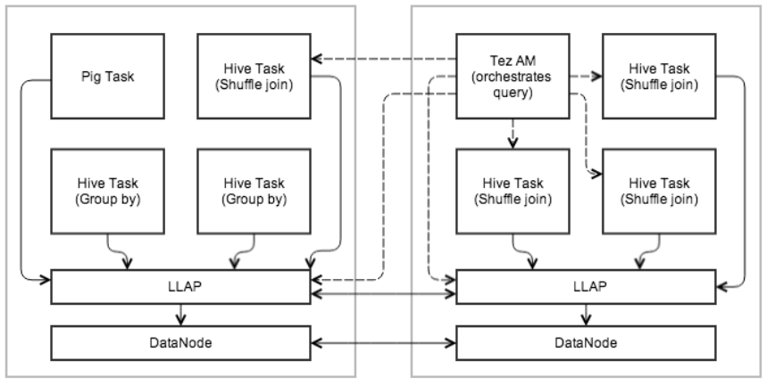

# LLAP Daemons

[TOC]

> Live Long And Process (LLAP) functionality was added in Hive 2.0 ([HIVE-7926](https://issues.apache.org/jira/browse/HIVE-7926) and associated tasks). [HIVE-9850](https://issues.apache.org/jira/browse/HIVE-9850) links documentation, features, and issues for this enhancement.

Hive 2.0 增加了 Live Long And Process(LLAP) 功能。

HIVE-9850 链接了这个增强的文档、特性和问题。

> For configuration of LLAP, see the LLAP Section of [Configuration Properties](https://cwiki.apache.org/confluence/display/Hive/Configuration+Properties#ConfigurationProperties-LLAP).

有关LLAP的配置，请参见 Configuration Properties 中的 LLAP 章节

## 1、Overview

> Hive has become significantly faster thanks to various features and improvements that were built by the community in recent years, including [Tez](https://cwiki.apache.org/confluence/display/Hive/Hive+on+Tez) and [Cost-based-optimization](https://cwiki.apache.org/confluence/display/Hive/Hive+on+Tez). The following were needed to take Hive to the next level:

Hive 的速度大大提高了，这要归功于社区近年来开发的各种特性和改进，包括 Tez 和基于成本的优化。以下便是将 Hive 带到下一个层次所需要的内容:

- Asynchronous spindle-aware IO
- Pre-fetching and caching of column chunks
- Multi-threaded JIT-friendly operator pipelines

> Also known as Live Long and Process, LLAP provides a hybrid execution model.  It consists of a long-lived daemon which replaces direct interactions with the HDFS DataNode, and a tightly integrated DAG-based framework.

LLAP 也称为 Live Long and Process，它提供了一种混合执行模型。

它由一个长期存在的守护进程(代替和 HDFS DataNode 的直接交互)和一个紧密集成的基于 DAG 的框架组成。

> Functionality such as caching, pre-fetching, some query processing and access control are moved into the daemon.  Small/short queries are largely processed by this daemon directly, while any heavy lifting will be performed in standard YARN containers.

缓存、预取、一些查询处理和访问控制等功能被转移到守护进程中。小的/短的查询在很大程度上是由这个守护进程直接处理的，而任何繁重的工作都将在标准的 YARN 容器中执行。

> Similar to the DataNode, LLAP daemons can be used by other applications as well, especially if a relational view on the data is preferred over file-centric processing. The daemon is also open through optional APIs (e.g., InputFormat) that can be leveraged by other data processing frameworks as a building block.

与 DataNode 类似，其他应用程序也可以使用 LLAP 守护进程，特别是在数据上的关系视图优于以文件为中心的处理时。

守护进程也可以通过可选的 APIs(例如，InputFormat)打开，其他数据处理框架可以利用这些 APIs 作为构建块。

> Last, but not least, fine-grained column-level access control – a key requirement for mainstream adoption of Hive – fits nicely into this model.

最后，但并非最不重要的是，细粒度的列级访问控制（主流采用 Hive 的一个关键要求）非常适合这个模型。

> The diagram below shows an example execution with LLAP. Tez AM orchestrates overall execution. The initial stage of the query is pushed into LLAP. In the reduce stage, large shuffles are performed in separate containers. Multiple queries and applications can access LLAP concurrently.

下面的图表显示了一个使用 LLAP 执行的例子。

Tez AM 负责整体执行。查询的初始阶段被推入 LLAP。在 reduce 阶段，大的 shuffles 是在单独的容器中进行的。多个查询和应用程序可以并发访问 LLAP。

## 2、Persistent Daemon

> To facilitate caching and JIT optimization, and to eliminate most of the startup costs, a daemon runs on the worker nodes on the cluster. The daemon handles I/O, caching, and query fragment execution.

为了方便缓存和 JIT 优化，并消除大部分启动成本，守护进程在集群的工作节点上运行。

这个守护进程处理 I/O、缓存和查询片段的执行。

> These nodes are stateless. Any request to an LLAP node contains the data location and metadata. It processes local and remote locations; locality is the caller’s responsibility (YARN).

- 这些节点是无状态的。

	任何对 LLAP 节点的请求都包含数据位置和元数据。它处理本地及远程位置；地点是调用者的责任(YARN)。

> Recovery/resiliency. Failure and recovery is simplified because any data node can still be used to process any fragment of the input data. The Tez AM can thus simply rerun failed fragments on the cluster.

- 恢复/弹性。

	由于仍然可以使用任何数据节点来处理输入数据的任何片段，所以故障和恢复都得到了简化。

	因此 Tez AM 可以简单地在集群上重新运行失败的片段。

> Communication between nodes. LLAP nodes are able to share data (e.g., fetching partitions, broadcasting fragments). This is realized with the same mechanisms used in Tez.

- 节点之间的通信。

	LLAP 节点能够共享数据(例如，获取分区，广播片段)。这是通过 Tez 中使用的相同机制实现的。

## 3、Execution Engine

> LLAP works within existing, process-based Hive execution to preserve the scalability and versatility of Hive. It does not replace the existing execution model but rather enhances it.

LLAP 在现有的基于进程的 Hive 执行中工作，以保持 Hive 的可扩展性和多功能性。它并没有取代现有的执行模型，而是增强了它。

> The daemons are optional. Hive can work without them and also is able to bypass them even if they are deployed and operational. Feature parity with regard to language features is maintained.

- 守护进程是可选的。

	Hive 可以在没有它们的情况下工作，也可以绕过它们，即使它们被部署和运行。在语言特性方面保持了特性的奇偶性。

> External orchestration and execution engines. LLAP is not an execution engine (like MapReduce or Tez). Overall execution is scheduled and monitored by an existing Hive execution engine (such as Tez) transparently over both LLAP nodes, as well as regular containers. Obviously, LLAP level of support depends on each individual execution engine (starting with Tez). MapReduce support is not planned, but other engines may be added later. Other frameworks like Pig also have the choice of using LLAP daemons.

- 外部编配和执行引擎。

	LLAP 不是一个执行引擎(像 MapReduce 或 Tez)。整体执行由现有的 Hive 执行引擎(如Tez)在 LLAP 节点和常规容器上透明地调度和监视。

	显然，LLAP 的支持级别取决于每个单独的执行引擎(从 Tez 开始)。没有计划支持 MapReduce，但以后可能会添加其他引擎。

	像 Pig 这样的其他框架也可以选择使用 LLAP 守护进程。

> Partial execution. The result of the work performed by an LLAP daemon can either form part of the result of a Hive query, or be passed on to external Hive tasks, depending on the query.

- 部分执行。

	LLAP 守护进程执行的工作结果可以构成 Hive 查询结果的一部分，也可以被传递到外部 Hive 任务中，这取决于查询。

> Resource Management. YARN remains responsible for the management and allocation of resources. The [YARN container delegation](https://issues.apache.org/jira/browse/YARN-1488) model is used to allow the transfer of allocated resources to LLAP. To avoid the limitations of JVM memory settings, cached data is kept off-heap, as well as large buffers for processing (e.g., group by, joins). This way, the daemon can use a small amount of memory, and additional resources (i.e., CPU and memory) will be assigned based on workload.

- 资源管理。

	YARN 仍然负责资源的管理和分配。YARN 容器委托模型用于将已分配的资源转移到 LLAP。

	为了避免 JVM 内存设置的限制，缓存的数据被保存在堆外，以及用于处理的大型缓冲区(例如group by、joins)。

	通过这种方式，守护进程可以使用少量内存，并且将根据工作负载分配额外的资源(即CPU和内存)。

## 4、Query Fragment Execution

> For partial execution as described above, LLAP nodes execute “query fragments” such as filters, projections, data transformations, partial aggregates, sorting, bucketing, hash joins/semi-joins, etc. Only Hive code and blessed UDFs are accepted in LLAP. No code is localized and executed on the fly. This is done for stability and security reasons.

对于上面描述的部分执行，LLAP 节点执行“查询片段”，如过滤器、投影、数据转换、部分聚合、排序、分桶、散列连接/半连接等。

只有 Hive 代码和 blessed UDFs 在 LLAP 中被接受。没有代码是本地化和动态执行的。这样做是为了稳定和安全。

> Parallel execution. An LLAP node allows parallel execution for multiple query fragments from different queries and sessions.

- 并行执行。

	LLAP 节点允许并行执行来自不同查询和会话的多个查询片段。

> Interface. Users can access LLAP nodes directly via client API. They are able to specify relational transformations and read data via record-oriented streams.

- 接口。

	用户可以通过客户端 API 直接访问 LLAP 节点。它们能够指定关系转换，并通过面向记录的流读取数据。

## 5、I/O

> The daemon off-loads I/O and transformation from compressed format to separate threads. The data is passed on to execution as it becomes ready, so the previous batches can be processed while the next ones are being prepared. The data is passed to execution in a simple RLE-encoded columnar format that is ready for vectorized processing; this is also the caching format, with the intent to minimize copying between I/O, cache, and execution.

这个守护进程将 I/O 和转换从压缩格式卸载到单独的线程。数据在准备就绪时传递给执行，以便在准备下一批数据时处理前一批数据。

数据以简单的 RLE-encoded 的柱状格式传递给执行，这个格式可以进行矢量化处理；这也是缓存格式，目的是尽量减少 I/O、缓存和执行之间的复制。

> Multiple file formats. I/O and caching depend on some knowledge of the underlying file format (especially if it is to be done efficiently). Therefore, similar to Vectorization work, different file formats will be supported through plugins specific to each format (starting with ORC). Additionally, a generic, less-efficient plugin may be added that supports any Hive input format. The plugins have to maintain metadata and transform the raw data to column chunks.

- 多种文件格式。

	I/O 和缓存依赖于对底层文件格式的一些了解(特别是如果要高效地完成这些工作的话)。因此，类似于矢量化工作，不同的文件格式将通过特定于每种格式的插件来支持(从 ORC 开始)。

	此外，还可以添加一个通用的、效率较低的插件来支持任何 Hive 输入格式。插件必须维护元数据，并将原始数据转换为列块。

> Predicates and bloom filters. SARGs and bloom filters are pushed down to storage layer, if they are supported.

- 谓词和布隆过滤器。

	如果支持 SARGs 和布隆过滤器，它们将被下推到存储层。

## 6、Caching

> The daemon caches metadata for input files, as well as the data. The metadata and index information can be cached even for data that is not currently cached. Metadata is stored in process in Java objects; cached data is stored in the format described in the [I/O section](https://cwiki.apache.org/confluence/display/Hive/LLAP#LLAP-I/O), and kept off-heap (see [Resource management](https://cwiki.apache.org/confluence/display/Hive/LLAP#LLAP-Resourcemanagement)).

守护进程缓存输入文件的元数据以及数据。可以缓存元数据和索引信息，甚至可以缓存当前没有缓存的数据。

元数据存储在 Java 对象的进程中；缓存的数据以 I/O 一节中描述的格式存储，并保存在堆外(请参阅资源管理)。

> Eviction policy. The eviction policy is tuned for analytical workloads with frequent (partial) table-scans. Initially, a simple policy like LRFU is used. The policy is pluggable.

- 回收策略。

	针对频繁的(部分)表扫描的分析工作负载调整了回收策略。最初，使用 LRFU 这样的简单策略。该策略是可插拔的。

> Caching granularity. Column-chunks are the unit of data in the cache. This achieves a compromise between low-overhead processing and storage efficiency. The granularity of the chunks depends on the particular file format and execution engine (Vectorized Row Batch size, ORC stripe, etc.).

- 缓存的粒度。

	列块是缓存中的数据单位。这实现了低开销处理和存储效率之间的折衷。块的粒度取决于特定的文件格式和执行引擎(向量化的行批次大小、ORC条带等)。

> A bloom filter is automatically created to provide Dynamic Runtime Filtering.

会自动创建一个布隆过滤器来提供动态运行时过滤。

## 7、Workload Management

> YARN is used to obtain resources for different workloads. Once resources (CPU, memory, etc.) have been obtained from YARN for a specific workload, the execution engine can choose to delegate these resources to LLAP, or to launch Hive executors in separate processes. Resource enforcement via YARN has the advantage of ensuring that nodes do not get overloaded, either by LLAP or by other containers. The daemons themselves is under YARN’s control.

YARN 用于为不同工作负载下获取资源。

一旦为特定工作负载，从 YARN 获得了资源(CPU，内存等)，执行引擎可以选择将这些资源委托给 LLAP，或者在单独的进程中启动 Hive executor。

通过 YARN 执行资源的优点是确保节点不会被 LLAP 或其他容器重载。

守护进程本身也在 YARN 的控制之下。

## 8、ACID Support

> LLAP is aware of transactions. The merging of delta files to produce a certain state of the tables is performed before the data is placed in cache.

LLAP 感知事务。在将数据放入缓存之前，会执行合并增量文件，以生成表的某种状态。

> Multiple versions are possible and the request specifies which version is to be used. This has the benefit of doing the merge asynchronously and only once for cached data, thus avoiding the hit on the operator pipeline.

可能有多个版本，请求指定要使用哪个版本。这样做的好处是异步执行合并，并且只对缓存的数据执行一次，从而避免了对操作符管道的影响。

## 9、Security

> LLAP servers are a natural place to enforce access control at a more fine-grained level than “per file”. Since the daemons know which columns and records are processed, policies on these objects can be enforced. This is not intended to replace the current mechanisms, but rather to enhance and open them up to other applications as well.

LLAP 服务器是在比“每个文件”更细粒度的级别上实施访问控制的自然地点。

由于守护进程知道要处理哪些列和记录，因此可以强制执行这些对象上的策略。这并不是要取代当前的机制，而是增强它们，并向其他应用程序开放它们。

## 10、Monitoring

> Configurations for LLAP monitoring are stored in resources.json, appConfig.json, metainfo.xml which are embedded into [templates.py](https://github.com/apache/hive/blob/master/llap-server/src/main/resources/templates.py) used by Slider. 

用于 LLAP 监视的配置存储在 resources.json、appConfig.json、metainfo.xml 中，它们被嵌入到 Slider 使用的 templates.py 中。

LLAP Monitor 守护进程运行在 YARN 容器上，与 LLAP 守护进程类似，在同一个端口上进行监听。

LLAP 度量收集服务定期从所有 LLAP 守护进程收集 JMX 度量。

LLAP 守护进程列表从集群中启动的 Zookeeper 服务器中提取。

> LLAP Monitor Daemon runs on YARN container, similar to LLAP Daemon, and listens on the same port.  
> The LLAP Metrics Collection Server collects JMX metrics from all LLAP Daemons periodically.  
> The list of LLAP Daemons are extracted from the Zookeeper server which launched in the cluster. 

## 11、Web Services

> [HIVE-9814](https://issues.apache.org/jira/browse/HIVE-9814) introduces the following web services:

- JSON JMX data - /jmx
- JVM Stack Traces of all threads - /stacks
- XML Configuration from llap-daemon-site - /conf 

> [HIVE-13398](https://issues.apache.org/jira/browse/HIVE-13398) introduces the following web services:

- LLAP Status - /status
- LLAP Peers - /peers

/status example

	curl localhost:15002/status
	 
	{
	  "status" : "STARTED",
	  "uptime" : 139093,
	  "build" : "2.1.0-SNAPSHOT from 77474581df4016e3899a986e079513087a945674 by gopal source checksum a9caa5faad5906d5139c33619f1368bb"
	}
 
/peers example 

	curl localhost:15002/peers
	{
	  "dynamic" : true,
	  "identity" : "718264f1-722e-40f1-8265-ac25587bf336",
	  "peers" : [
	 {
	    "identity" : "940d6838-4dd7-4e85-95cc-5a6a2c537c04",
	    "host" : "sandbox121.hortonworks.com",
	    "management-port" : 15004,
	    "rpc-port" : 15001,
	    "shuffle-port" : 15551,
	    "resource" : {
	      "vcores" : 24,
	      "memory" : 128000
	    },
	    "host" : "sandbox121.hortonworks.com"
	  },
	]
	}

## 12、SLIDER on YARN Deployment

> LLAP can be deployed via [Slider](https://cwiki.apache.org/confluence/display/SLIDER/Slider+Home), which bypasses node installation and related complexities ([HIVE-9883](https://issues.apache.org/jira/browse/HIVE-9883)).

LLAP 可以通过 Slider 部署，Slider 可以绕过节点安装和相关的复杂性。

## 13、LLAP Status

> [AMBARI-16149](https://issues.apache.org/jira/browse/AMBARI-16149) introduces LLAP app status, available with HiveServer2.

AMBARI-16149 引入了 LLAP 应用状态，和 HiveServer2 可用。

Example usage.

	/current/hive-server2-hive2/bin/hive --service llapstatus --name {llap_app_name} [-f] [-w] [-i] [-t]

	-f,--findAppTimeout <findAppTimeout>                 Amount of time(s) that the tool will sleep to wait for the YARN application to start. negative values=wait
	                                                     forever, 0=Do not wait. default=20s
	-H,--help                                            Print help information
	   --hiveconf <property=value>                       Use value for given property. Overridden by explicit parameters
	-i,--refreshInterval <refreshInterval>               Amount of time in seconds to wait until subsequent status checks in watch mode. Valid only for watch mode.
	                                                     (Default 1s)
	-n,--name <name>                                     LLAP cluster name
	-o,--outputFile <outputFile>                         File to which output should be written (Default stdout)
	-r,--runningNodesThreshold <runningNodesThreshold>   When watch mode is enabled (-w), wait until the specified threshold of nodes are running (Default 1.0
	                                                     which means 100% nodes are running)
	-t,--watchTimeout <watchTimeout>                     Exit watch mode if the desired state is not attained until the specified timeout. (Default 300s)
	-w,--watch                                           Watch mode waits until all LLAP daemons are running or subset of the nodes are running (threshold can be
	                                                     specified via -r option) (Default wait until all nodes are running)

Version information. The findAppTimeout option was added in release 2.1.0 with [HIVE-13643](https://issues.apache.org/jira/browse/HIVE-13643): -f or --findAppTimeout. The watch and running nodes options were added in release 2.2.0 with [HIVE-15217](https://issues.apache.org/jira/browse/HIVE-15217) and [HIVE-15651](https://issues.apache.org/jira/browse/HIVE-15651): -w or --watch, -i or --refreshInterval, -t or --watchTimeout, and -r or --runningNodesThreshold.

## 14、Resources

[LLAP Design Document](https://issues.apache.org/jira/secure/attachment/12665704/LLAPdesigndocument.pdf)

[Hive Contributor Meetup Presentation](https://cwiki.apache.org/confluence/download/attachments/27362054/LLAP-Meetup-Nov.ppsx?version=1&modificationDate=1447885307000&api=v2)