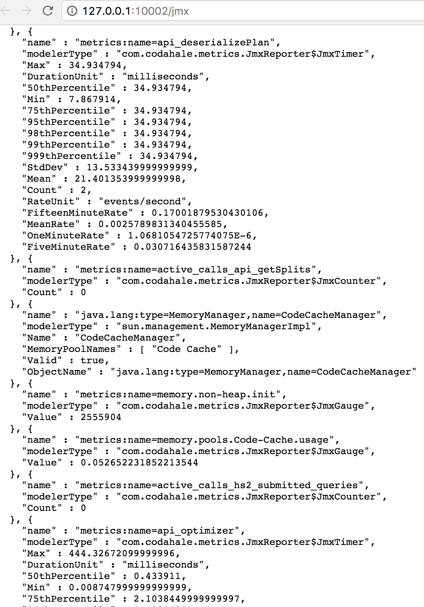

# Hive Metrics

> The metrics that Hive collects can be viewed in the HiveServer2 Web UI by using the "Metrics Dump" tab.

Hive 收集的指标可以通过使用 Metrics Dump tab 在 HiveServer2 Web UI 中查看。

> The metrics dump will display any metric available over JMX encoded in JSON: 

指标转储将显示 JSON 编码的 JMX 上可用的任何指标:

> Alternatively the metrics can be written directly into HDFS, a JSON file on the local file system where the HS2 instance is running or to the console by enabling the corresponding metric reporters. By default only the JMX and the JSON file reporter are enabled.

另外，指标也可以直接写入 HDFS，即运行 HS2 实例的本地文件系统上的 JSON 文件，或者通过启用相应的指标报告器写入控制台。

默认情况下，只有 JMX 和 JSON 文件报告器是启用的。

> These metrics include:

包含这些指标：

指标见原文：[https://cwiki.apache.org/confluence/display/Hive/Hive+Metrics](https://cwiki.apache.org/confluence/display/Hive/Hive+Metrics)