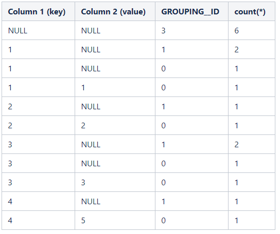
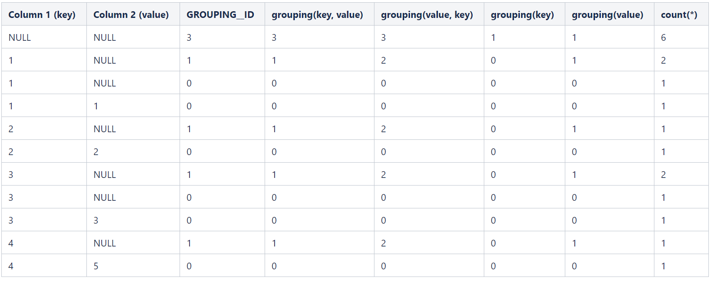

# Enhanced Aggregation, Cube, Grouping and Rollup

[TOC]

> This document describes enhanced aggregation features for the GROUP BY clause of SELECT statements.

本文档描述了 SELECT 语句的 GROUP BY 子句的增强聚合特性。

> Version:Grouping sets, CUBE and ROLLUP operators, and the GROUPING__ID function were added in Hive 0.10.0.See [HIVE-2397](https://issues.apache.org/jira/browse/HIVE-2397), [HIVE-3433](https://issues.apache.org/jira/browse/HIVE-3433), [HIVE-3471](https://issues.apache.org/jira/browse/HIVE-3471), and [HIVE-3613](https://issues.apache.org/jira/browse/HIVE-3613).Also see HIVE-3552](https://issues.apache.org/jira/browse/HIVE-3552) for an improvement added in Hive 0.11.0.

> Version:GROUPING__ID is compliant with semantics in other SQL engines starting in Hive 2.3.0 (see [HIVE-16102](https://issues.apache.org/jira/browse/HIVE-16102)).Support for SQL grouping function was added in Hive 2.3.0 too (see [HIVE-15409](https://issues.apache.org/jira/browse/HIVE-15409)).

> For general information about GROUP BY, see [GroupBy](https://cwiki.apache.org/confluence/display/Hive/LanguageManual+GroupBy) in the Language Manual.

## 1、GROUPING SETS clause

> The GROUPING SETS clause in GROUP BY allows us to specify more than one GROUP BY option in the same record set. All GROUPING SET clauses can be logically expressed in terms of several GROUP BY queries connected by UNION. Table-1 shows several such equivalent statements. This is helpful in forming the idea of the GROUPING SETS clause. A blank set ( ) in the GROUPING SETS clause calculates the overall aggregate.

`GROUP BY` 中的 **`GROUPING SETS` 子句可以在同一个记录集中指定多个 `GROUP BY` 选项**。

**所有 `GROUP SET` 子句都可以用由 UNION 连接的多个 `GROUP BY` 查询逻辑表示**。

Table-1 显示了几个类似的语句。这有助于形成 `GROUPING SETS` 子句的思想。

**`GROUPING SETS` 子句中的空 set() 计算总体聚合**。

> Table 1 - GROUPING SET queries and the equivalent GROUP BY queries

Aggregate Query with GROUPING SET | Equivalent Aggregate Query with GROUP BY
---|:---
SELECT a, b, SUM(c) FROM tab1 GROUP BY a, b GROUPING SETS ((a,b))   | SELECT a, b, SUM(c) FROM tab1 GROUP BY a, b
SELECT a, b, SUM(c) FROM tab1 GROUP BY a, b GROUPING SETS ((a,b), a) | SELECT a, b, SUM(c) FROM tab1 GROUP BY a, b UNION SELECT a, null, SUM(c) FROM tab1 GROUP BY a
SELECT a, b, SUM(c) FROM tab1 GROUP BY a, b GROUPING SETS (a,b) | SELECT a, null, SUM(c) FROM tab1 GROUP BY a UNION SELECT null, b, SUM(c) FROM tab1 GROUP BY b
SELECT a, b, SUM(c) FROM tab1 GROUP BY a, b GROUPING SETS ((a,b),a,b,()) | SELECT a, b, SUM(c) FROM tab1 GROUP BY a, b UNION SELECT a, null, SUM(c) FROM tab1 GROUP BY a, null UNION SELECT null, b, SUM(c) FROM tab1 GROUP BY null, b UNION SELECT null, null, SUM(c) FROM tab1

## 2、Grouping__ID function

> When aggregates are displayed for a column its value is null. This may conflict in case the column itself has some null values. There needs to be some way to identify NULL in column, which means aggregate and NULL in column, which means value. GROUPING__ID function is the solution to that.

当一个列聚合的值是 null，而列本身有一些空值，这可能会冲突。

需要某种方法来识别列中的 NULL...。`GROUPING__ID` 函数是这个问题的解决方案。

> This function returns a bitvector corresponding to whether each column is present or not. For each column, a value of "1" is produced for a row in the result set if that column has been aggregated in that row, otherwise the value is "0". This can be used to differentiate when there are nulls in the data.

这个函数返回一个位向量，对应于每个列是否存在。

**对于每一列，如果该列在一行被聚合，那么结果集中的这行会产生值 1，否则产生 0**。

这可以用来区分数据中是否存在空值。

> Consider the following example:

Column 1(key) | Column 2(value)
---|:---
1  | NULL
1  | 1
2  | 2
3  | 3
3  | NULL
4  | 5

> The following query:

```sql
SELECT key, value, GROUPING__ID, count(*)
FROM T1
GROUP BY key, value WITH ROLLUP;

# GROUP BY a, b, c, WITH ROLLUP 
# is equivalent to 
# GROUP BY a, b, c GROUPING SETS ( (a, b, c), (a, b), (a), ( )).

# 等价于：
# GROUP BY key, value GROUPING SETS( (key, value), (key), ())
# 等价于：
SELECT key, value, GROUPING__ID, count(*) FROM T1 GROUP BY key, value
UNION
SELECT key, null, GROUPING__ID, count(*) FROM T1 GROUP BY key, null
UNION
SELECT null, null, GROUPING__ID, count(*) FROM T1

```

> will have the following results:



注意，第三列是被选中列的位向量。

对于第一行，没有选择任何列。 【`SELECT null, null, GROUPING__ID, count(*) FROM T1`】

对于第二行，只选择了第一列，这解释了值1。【`SELECT key, null, GROUPING__ID, count(*) FROM T1 GROUP BY key, null`】

对于第三行，两个列都被选中(第二列恰好是null)，这解释了值0的含义。【`SELECT key, value, GROUPING__ID, count(*) FROM T1 GROUP BY key, value`】

> Note that the third column is a bitvector of columns being selected.

> For the first row, none of the columns are being selected.

> For the second row, only the first column is being selected, which explains the value 1.

> For the third row, both the columns are being selected (and the second column happens to be null), which explains the value 0.

## 3、Grouping function

> The grouping function indicates whether an expression in a GROUP BY clause is aggregated or not for a given row. The value 0 represents a column that is part of the grouping set, while the value 1 represents a column that is not part of the grouping set. 

分组函数表示**是否为给定行聚合 GROUP BY 子句中的表达式**。值 0 表示属于分组集的列，而值 1 表示不属于分组集的列。【1：聚合了。0：没聚合】

> Going back to our example above, consider the following query:

回到上面的例子，考虑下面的查询:

```sql
SELECT key, value, GROUPING__ID,
  grouping(key, value), grouping(value, key), grouping(key), grouping(value),
  count(*)
FROM T1
GROUP BY key, value WITH ROLLUP;
```

> This query will produce the following results.




## 4、Cubes and Rollups

> The general syntax is WITH CUBE/ROLLUP. It is used with the GROUP BY only. CUBE creates a subtotal of all possible combinations of the set of column in its argument. Once we compute a CUBE on a set of dimension, we can get answer to all possible aggregation questions on those dimensions.

一般的语法是 **`WITH CUBE/ROLLUP`。它只能与 ` GROUP BY` 一起使用**。

`CUBE` 创建**在其参数中的列集的所有可能组合的小计**。一旦我们在一组维度上计算了一个 `CUBE`，我们就可以得到在这些维度上**所有可能的聚合问题的答案**。

> It might be also worth mentioning here that 
GROUP BY a, b, c WITH CUBE is equivalent to 
GROUP BY a, b, c GROUPING SETS ( (a, b, c), (a, b), (b, c), (a, c), (a), (b), (c), ( )).

这里还值得一提的是：**`GROUP BY a, b, c WITH CUBE` 等价 `GROUP BY a, b, c GROUPING SETS ((a, b, c), (a, b), (b, c), (a, c), (a), (b), (c), ())`**。

> ROLLUP clause is used with GROUP BY to compute the aggregate at the hierarchy levels of a dimension.

`ROLLUP` 子句与 `GROUP BY` 一起使用，用于**在一个维度的层次结构级别上计算聚合**。

> GROUP BY a, b, c with ROLLUP assumes that the hierarchy is "a" drilling down to "b" drilling down to "c".

**`GROUP BY a, b, c with ROLLUP` 假设层次结构是 a 下钻到 b ，再下钻到 c**。

> GROUP BY a, b, c, WITH ROLLUP is equivalent to GROUP BY a, b, c GROUPING SETS ( (a, b, c), (a, b), (a), ( )).

**`GROUP BY a, b, c with ROLLUP` 等价 `GROUP BY a, b, c GROUPING SETS ((a, b, c), (a, b), (a), ())`**

## 5、hive.new.job.grouping.set.cardinality

> Whether a new map-reduce job should be launched for grouping sets/rollups/cubes. For a query like: select a, b, c, count(1) from T group by a, b, c with rollup; 4 rows are created per row: (a, b, c), (a, b, null), (a, null, null), (null, null, null). This can lead to explosion across map-reduce boundary if the cardinality of T is very high and map-side aggregation does not do a very good job.

是否应该为 grouping sets/rollups/cubes 启动一个新的 map-reduce job。

对于这种查询：`select a, b, c, count(1) from T group by a, b, c with rollup`

每一行创建 4 行:(a, b, c)，(a, b, null)，(a, null, null)，(null, null)。

如果 T 的基数非常高，而 map 端聚合不能很好地完成工作，那么这可能会导致跨 map-reduce 边界的 explosion。

> This parameter decides if hive should add an additional map-reduce job. If the grouping set cardinality (4 in the example above), is more than this value, a new MR job is added under the assumption that the orginal group by will reduce the data size.

**该参数决定 hive 是否需要增加一个额外的 map-reduce job**。

如果分组集基数(在上面的示例中为4)大于这个值，则会添加一个新的 MR job，在原 group by 将减少数据大小的假设下。

## 6、Grouping__ID function (before Hive 2.3.0)

> Grouping__ID function was fixed in Hive 2.3.0, thus behavior before that release is different (this is expected). For each column, the function would return a value of "0" if that column has been aggregated in that row, otherwise the value is "1".

`Grouping__ID` 函数在 Hive 2.3.0 中被修复，因此在发布之前的行为是不同的(这是预期的)。

对于每一列，如果该列已在该行聚合，则该函数将返回一个值0，否则该值为1。

> Hence the following query:

```sql
SELECT key, value, GROUPING__ID, count(*)
FROM T1
GROUP BY key, value WITH ROLLUP;
```

> will have the following results.


注意，第三列是被选中列的位向量。

对于第一行，没有选择任何列。

对于第二行，只选择了第一列，这解释了计数2。

对于第三行，两个列都被选中(第二列恰好是null)，这解释了计数为1的原因。

> Note that the third column is a bitvector of columns being selected.

> For the first row, none of the columns are being selected.

> For the second row, only the first column is being selected, which explains the count of 2.

> For the third row, both the columns are being selected (and the second column happens to be null), which explains the count of 1.


参考：[https://www.cnblogs.com/qingyunzong/p/8798987.html#_label2](https://www.cnblogs.com/qingyunzong/p/8798987.html#_label2)