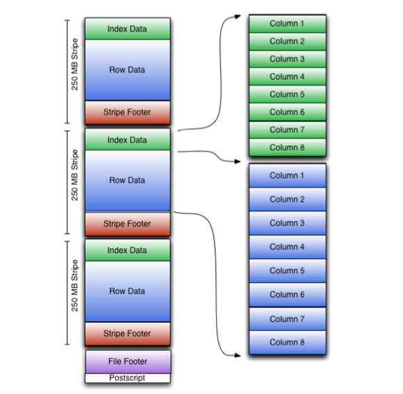

# LanguageManual ORC

[TOC]

## 1、ORC Files

### 1.1、ORC File Format

> Version:Introduced in Hive version [0.11.0](https://issues.apache.org/jira/browse/HIVE-3874).

版本：在 Hive 0.11.0 版本引入。

> The Optimized Row Columnar ([ORC](https://orc.apache.org/)) file format provides a highly efficient way to store Hive data. It was designed to overcome limitations of the other Hive file formats. Using ORC files improves performance when Hive is reading, writing, and processing data.

Optimized Row Columnar 文件格式提供了一种高效的存储 Hive 数据的方式。它的设计是为了克服其他 Hive 文件格式的限制。使用 ORC 文件可以提高 Hive 读写和处理数据时的性能。

> Compared with RCFile format, for example, ORC file format has many advantages such as:

例如，与 RCFile 格式相比，ORC 文件格式有很多优点，如:

> a single file as the output of each task, which reduces the NameNode's load

- 单个文件作为每个任务的输出，这减少了 NameNode 的负载

> Hive type support including datetime, decimal, and the complex types (struct, list, map, and union)

- 支持 Hive 类型，包括 datetime、decimal 和复杂类型(struct、list、map 和 union)

> light-weight indexes stored within the file

- 存储在文件中的轻量级索引

	- 跳过没有通过谓词过滤的行组
	- 查找给定的行

> skip row groups that don't pass predicate filtering

> seek to a given row

> block-mode compression based on data type

- 基于数据类型的块模式压缩

	- 整数列的行程长度编码
	- 字符串列的字典编码

> run-length encoding for integer columns

> dictionary encoding for string columns

> concurrent reads of the same file using separate RecordReaders

- 使用单独的 RecordReaders 并发读取同一文件

> ability to split files without scanning for markers

- 能够划分文件，而不扫描标记

> bound the amount of memory needed for reading or writing

- 限制读写所需的内存量

> metadata stored using Protocol Buffers, which allows addition and removal of fields

- 使用协议缓冲区存储的元数据，允许添加和删除字段

#### 1.1.1、File Structure

> An ORC file contains groups of row data called stripes, along with auxiliary information in a file footer. At the end of the file a postscript holds compression parameters and the size of the compressed footer.

ORC 文件包含一组称为 stripes 的行数据，以及 file footer 中的辅助信息。在文件的末尾，postscript 保存压缩参数和压缩页脚的大小。

> The default stripe size is 250 MB. Large stripe sizes enable large, efficient reads from HDFS.

默认的 stripe 大小为 250 MB。大的 stripe 大小可以使读取 HDFS 的数据量更大、更高效。

> The file footer contains a list of stripes in the file, the number of rows per stripe, and each column's data type. It also contains column-level aggregates count, min, max, and sum.

file footer 包含文件中的 stripes 列表、每个 stripes 的行数和每个列的数据类型。它还包含列级聚合 count、min、max 和 sum。

> This diagram illustrates the ORC file structure:

下图说明了 ORC 文件的结构:



#### 1.1.2、Stripe Structure

> As shown in the diagram, each stripe in an ORC file holds index data, row data, and a stripe footer.

如图所示，ORC 文件中的每个 stripe 保存 index data、row data 和一个 stripe footer。

> The stripe footer contains a directory of stream locations. Row data is used in table scans.

stripe footer 包含一个流位置的目录。Row data 在表扫描中使用。

> Index data includes min and max values for each column and the row positions within each column. (A bit field or bloom filter could also be included.) Row index entries provide offsets that enable seeking to the right compression block and byte within a decompressed block.  Note that ORC indexes are used only for the selection of stripes and row groups and not for answering queries.

Index data 包括每个列的最小值和最大值，以及每个列中的行位置。(也可以包含位域或bloom filter。)

行索引提供了能够在解压缩块中查找右边的压缩块和字节的偏移量。注意，ORC 索引仅用于选择 stripes 和行组，而不是用于回答查询。

> Having relatively frequent row index entries enables row-skipping within a stripe for rapid reads, despite large stripe sizes. By default every 10,000 rows can be skipped.

拥有相对频繁的行索引项可以支持在 stripe 内跳过行，以快速读取，尽管 stripe 大小很大。默认情况下，可以跳过每 10000 行。

> With the ability to skip large sets of rows based on filter predicates, you can sort a table on its secondary keys to achieve a big reduction in execution time. For example, if the primary partition is transaction date, the table can be sorted on state, zip code, and last name. Then looking for records in one state will skip the records of all other states.

有了基于过滤谓词跳过大量行集的能力，你可以根据表的辅助键对表进行排序，从而大大减少执行时间。例如，如果主分区是事务日期，则可以按州、邮政编码和姓氏对表进行排序。然后，查找一个州的记录将跳过所有其他州的记录。

> A complete specification of the format is given in the [ORC specification](https://cwiki.apache.org/confluence/display/Hive/LanguageManual+ORC#LanguageManualORC-orc-spec).

ORC 规范中给出了该格式的完整规范。

### 1.2、HiveQL Syntax

> File formats are specified at the table (or partition) level. You can specify the ORC file format with HiveQL statements such as these:

可以在表（或分区）级别指定文件格式。

- CREATE TABLE ... STORED AS ORC
- ALTER TABLE ... [PARTITION partition_spec] SET FILEFORMAT ORC
- SET hive.default.fileformat=Orc

> The parameters are all placed in the TBLPROPERTIES (see [Create Table](https://cwiki.apache.org/confluence/display/Hive/LanguageManual+DDL#LanguageManualDDL-CreateTable)). They are:

参数都放在 TBLPROPERTIES 中：

Key               |    Default   |  Notes
---|:---|:---
orc.compress      |     ZLIB     |  high level compression (one of `NONE`, `ZLIB`, `SNAPPY`)
orc.compress.size |    262,144   |  number of bytes in each compression chunk
orc.stripe.size   |  67,108,864  |  number of bytes in each stripe
orc.row.index.stride |  10,000   |  number of rows between index entries (must be >= 1000)
orc.create.index  |     true     |  whether to create row indexes
orc.bloom.filter.columns  |	""	 |  comma separated list of column names for which bloom filter should be created
orc.bloom.filter.fpp  |	 0.05	 |  false positive probability for bloom filter (must >0.0 and <1.0)

> For example, creating an ORC stored table without compression:

```sql
create table Addresses (
  name string,
  street string,
  city string,
  state string,
  zip int
) stored as orc tblproperties ("orc.compress"="NONE");
```

> Version 0.14.0+: CONCATENATE

> [ALTER TABLE table_name [PARTITION partition_spec] CONCATENATE](https://cwiki.apache.org/confluence/display/Hive/LanguageManual+DDL#LanguageManualDDL-AlterTable/PartitionConcatenate) can be used to merge small ORC files into a larger file, starting in [Hive 0.14.0](https://issues.apache.org/jira/browse/HIVE-7509). The merge happens at the stripe level, which avoids decompressing and decoding the data.

从 Hive 0.14.0 开始，`ALTER TABLE table_name [PARTITION partition_spec] CONCATENATE` 可以用来合并小的 ORC 文件称一个大的文件。这个合并发送在 stripe 级别，避免了解压缩和解码数据。

### 1.3、Serialization and Compression

> The serialization of column data in an ORC file depends on whether the data type is integer or string.

在一个 ORC 文件中，列数据的序列化取决于数据类型是否是整型或字符串。

#### 1.3.1、Integer Column Serialization

> Integer columns are serialized in two streams.

整数列在两个流中序列化。

- 当前位流：值是非空的吗?
- 数据流：整数流

> present bit stream: is the value non-null?

> data stream: a stream of integers

> Integer data is serialized in a way that takes advantage of the common distribution of numbers:

整数数据的序列化方式利用了数值的普通分布:

- 整数使用可变宽度编码，对于小的整数的字节数更少。
- 重复的值是行程长度编码的。
- 在范围 (-128到127) 中与常量不同的值是行程长度编码的。

> Integers are encoded using a variable-width encoding that has fewer bytes for small integers.

> Repeated values are run-length encoded.

> Values that differ by a constant in the range (-128 to 127) are run-length encoded.

> The variable-width encoding is based on Google's protocol buffers and uses the high bit to represent whether this byte is not the last and the lower 7 bits to encode data. To encode negative numbers, a zigzag encoding is used where 0, -1, 1, -2, and 2 map into 0, 1, 2, 3, 4, and 5 respectively.

可变宽度编码基于谷歌的协议缓冲区，并使用高位表示该字节是否不是最后7位和较低的7位来编码数据。为了编码负数，使用 zigzag 编码，其中0、-1、1、-2和2分别映射为0、1、2、3、4和5。

> Each set of numbers is encoded this way:

每组数字都是这样编码的:

- 如果第一个字节(b0)为负:

	- `-b0`后面跟着可变长度的整数。

- 如果第一个字节(b0)为正:

	- 它表示 `b0 + 3` 个重复整数

	- 在每个副本间添加第二个字节(-128到+127)

	- 1 变长整数。

> If the first byte (b0) is negative:

> -b0 variable-length integers follow.

> If the first byte (b0) is positive:

> it represents b0 + 3 repeated integers

> the second byte (-128 to +127) is added between each repetition

> 1 variable-length integer.

> In run-length encoding, the first byte specifies run length and whether the values are literals or duplicates. Duplicates can step by -128 to +128. Run-length encoding uses protobuf style variable-length integers.

在行程长度编码中，第一个字节指定运行长度以及值是文字还是重复。副本可以步进 -128 到 +128 。行程长度编码使用 protobuf 风格的变长整数。

#### 1.3.2、String Column Serialization

> Serialization of string columns uses a dictionary to form unique column values. The dictionary is sorted to speed up predicate filtering and improve compression ratios.

字符串列的序列化使用字典来形成唯一的列值。排序字典，以加快谓词过滤和提高压缩比。

> String columns are serialized in four streams.

字符串列在四个流中序列化。

- 当前位流:值是非空的吗?

- 字典数据:字符串的字节

- 字典长度:每个条目的长度

- 行数据:行值

> present bit stream: is the value non-null?

> dictionary data: the bytes for the strings

> dictionary length: the length of each entry

> row data: the row values

> Both the dictionary length and the row values are run-length encoded streams of integers.

字典长度和行值都是行程长度编码的整数流。

#### 1.3.3、Compression

> Streams are compressed using a codec, which is specified as a table property for all streams in that table. To optimize memory use, compression is done incrementally as each block is produced. Compressed blocks can be jumped over without first having to be decompressed for scanning. Positions in the stream are represented by a block start location and an offset into the block.

使用一个编解码器压缩流，它为该表中的所有流被指定为一个表属性。

为了优化内存使用，压缩是在生成每个块时增量进行的。压缩块可以跳过，而不必首先为了扫描解压。

流中的位置由块的起始位置和块中的偏移量表示。

> The codec can be Snappy, Zlib, or none.

编解码器可以是 Snappy、Zlib 或 none。

### 1.4、ORC File Dump Utility

> The ORC file dump utility analyzes ORC files.  To invoke it, use this command:

ORC 文件转储实用程序分析 ORC 文件。要调用它，使用以下命令:

	// Hive version 0.11 through 0.14:
	hive --orcfiledump <location-of-orc-file>
	  
	// Hive version 1.1.0 and later:
	hive --orcfiledump [-d] [--rowindex <col_ids>] <location-of-orc-file>
	  
	// Hive version 1.2.0 and later:
	hive --orcfiledump [-d] [-t] [--rowindex <col_ids>] <location-of-orc-file>
	  
	// Hive version 1.3.0 and later:
	hive --orcfiledump [-j] [-p] [-d] [-t] [--rowindex <col_ids>] [--recover] [--skip-dump] 
	    [--backup-path <new-path>] <location-of-orc-file-or-directory>

> Specifying -d in the command will cause it to dump the ORC file data rather than the metadata (Hive [1.1.0](https://cwiki.apache.org/confluence/display/Hive/LanguageManual+ORC#LanguageManualORC-StripeStructure) and later).

- 在命令中指定 `-d` 将导致转储 ORC 文件数据，而不是元数据(Hive 1.1.0及更高版本)。

> Specifying --rowindex with a comma separated list of column ids will cause it to print [row indexes](https://cwiki.apache.org/confluence/display/Hive/LanguageManual+ORC#LanguageManualORC-StripeStructure) for the specified columns, where 0 is the top level struct containing all of the columns and 1 is the first column id (Hive 1.1.0 and later).

- 指定 `--rowindex`，用逗号分隔的列 id 的列表，将导致打印指定列的行索引，其中 0 是包含所有列的顶级结构体，1 是第一列 id (Hive 1.1.0及以后版本)。

> Specifying -t in the command will print the timezone id of the writer.

- 在命令中指定 `-t` 将打印写入器的时区 id。

> Specifying -j in the command will print the ORC file metadata in JSON format. To pretty print the JSON metadata, add -p to the command.

- 在命令中指定 `-j` 将以 JSON 格式打印 ORC 文件元数据。为了更好地打印 JSON 元数据，向命令中添加 `-p`。

> Specifying --recover in the command will recover a corrupted ORC file generated by Hive streaming.

- 在命令中指定 `--recover` 将恢复由 Hive streaming 生成的损坏的 ORC 文件。

> Specifying --skip-dump along with --recover will perform recovery without dumping metadata.

- 指定 `--skip-dump` 和 `--recover` 将在不转储元数据的情况下执行恢复。

> Specifying --backup-path with a new-path will let the recovery tool move corrupted files to the specified backup path (default: /tmp).

- 使用新路径指定 `--backup-path` 将允许恢复工具将损坏的文件移动到指定的备份路径(默认:`/tmp`)。

> `<location-of-orc-file>` is the URI of the ORC file.

- `<location-of-orc-file>` 是 ORC 文件的 URI。

> `<location-of-orc-file-or-directory>` is the URI of the ORC file or directory. From [Hive 1.3.0](https://issues.apache.org/jira/browse/HIVE-11669) onward, this URI can be a directory containing ORC files.

- `<location-of-orc-file-or-directory>` 是 ORC 文件或目录的 URI。从 Hive 1.3.0 开始，这个 URI 可以是一个包含 ORC 文件的目录。


### 1.5、ORC Configuration Parameters

> The ORC configuration parameters are described in Hive Configuration Properties – [ORC File Format](https://cwiki.apache.org/confluence/display/Hive/Configuration+Properties#ConfigurationProperties-ORCFileFormat).

## 2、ORC Format Specification

> The ORC specification has moved to [ORC project](https://orc.apache.org/specification/).


---------------------------------------------------

```sql
create table orc_test(
    name string,
    favorite_color string
)STORED AS orc;

hive>  load data local inpath '/root/data/users.orc' into table orc_test;
Loading data to table default.orc_test
OK

hive> select * from orc_test;
OK
Alyssa  NULL
Ben     red

-- hdfs 目录
[root@zgg hive-3.1.2]# hive --orcfiledump -j -p /in/users.orc       
Processing data file /in/users.orc [length: 547]
{
  "fileName": "\/in\/users.orc",
  "fileVersion": "0.12",
  "writerVersion": "ORC_135",
  "numberOfRows": 2,
  "compression": "SNAPPY",
  "compressionBufferSize": 262144,
  "schemaString": "struct<name:string,favorite_color:string,favorite_numbers:array<int>>",
  "schema": [
    {
      "columnId": 0,
      "columnType": "STRUCT",
      "childColumnNames": [
        "name",
        "favorite_color",
        "favorite_numbers"
      ],
      "childColumnIds": [
        1,
        2,
        3
      ]
    },
    {
      "columnId": 1,
      "columnType": "STRING"
    },
    {
      "columnId": 2,
      "columnType": "STRING"
    },
    {
      "columnId": 3,
      "columnType": "LIST"
    },
    {
      "columnId": 4,
      "columnType": "INT"
    }
  ],
  "stripeStatistics": [{
    "stripeNumber": 1,
    "columnStatistics": [
      {
        "columnId": 0,
        "count": 2,
        "hasNull": false
      },
      {
        "columnId": 1,
        "count": 2,
        "hasNull": false,
        "bytesOnDisk": 18,
        "min": "Alyssa",
        "max": "Ben",
        "totalLength": 9,
        "type": "STRING"
      },
      {
        "columnId": 2,
        "count": 1,
        "hasNull": true,
        "bytesOnDisk": 17,
        "min": "red",
        "max": "red",
        "totalLength": 3,
        "type": "STRING"
      },
      {
        "columnId": 3,
        "count": 2,
        "hasNull": false,
        "bytesOnDisk": 6
      },
      {
        "columnId": 4,
        "count": 4,
        "hasNull": false,
        "bytesOnDisk": 8,
        "min": 3,
        "max": 20,
        "sum": 47,
        "type": "LONG"
      }
    ]
  }],
  "fileStatistics": [
    {
      "columnId": 0,
      "count": 2,
      "hasNull": false
    },
    {
      "columnId": 1,
      "count": 2,
      "hasNull": false,
      "bytesOnDisk": 18,
      "min": "Alyssa",
      "max": "Ben",
      "totalLength": 9,
      "type": "STRING"
    },
    {
      "columnId": 2,
      "count": 1,
      "hasNull": true,
      "bytesOnDisk": 17,
      "min": "red",
      "max": "red",
      "totalLength": 3,
      "type": "STRING"
    },
    {
      "columnId": 3,
      "count": 2,
      "hasNull": false,
      "bytesOnDisk": 6
    },
    {
      "columnId": 4,
      "count": 4,
      "hasNull": false,
      "bytesOnDisk": 8,
      "min": 3,
      "max": 20,
      "sum": 47,
      "type": "LONG"
    }
  ],
  "stripes": [{
    "stripeNumber": 1,
    "stripeInformation": {
      "offset": 3,
      "indexLength": 119,
      "dataLength": 49,
      "footerLength": 101,
      "rowCount": 2
    },
    "streams": [
      {
        "columnId": 0,
        "section": "ROW_INDEX",
        "startOffset": 3,
        "length": 11
      },
      {
        "columnId": 1,
        "section": "ROW_INDEX",
        "startOffset": 14,
        "length": 35
      },
      {
        "columnId": 2,
        "section": "ROW_INDEX",
        "startOffset": 49,
        "length": 33
      },
      {
        "columnId": 3,
        "section": "ROW_INDEX",
        "startOffset": 82,
        "length": 16
      },
      {
        "columnId": 4,
        "section": "ROW_INDEX",
        "startOffset": 98,
        "length": 24
      },
      {
        "columnId": 1,
        "section": "DATA",
        "startOffset": 122,
        "length": 12
      },
      {
        "columnId": 1,
        "section": "LENGTH",
        "startOffset": 134,
        "length": 6
      },
      {
        "columnId": 2,
        "section": "PRESENT",
        "startOffset": 140,
        "length": 5
      },
      {
        "columnId": 2,
        "section": "DATA",
        "startOffset": 145,
        "length": 6
      },
      {
        "columnId": 2,
        "section": "LENGTH",
        "startOffset": 151,
        "length": 6
      },
      {
        "columnId": 3,
        "section": "LENGTH",
        "startOffset": 157,
        "length": 6
      },
      {
        "columnId": 4,
        "section": "DATA",
        "startOffset": 163,
        "length": 8
      }
    ],
    "encodings": [
      {
        "columnId": 0,
        "kind": "DIRECT"
      },
      {
        "columnId": 1,
        "kind": "DIRECT_V2"
      },
      {
        "columnId": 2,
        "kind": "DIRECT_V2"
      },
      {
        "columnId": 3,
        "kind": "DIRECT_V2"
      },
      {
        "columnId": 4,
        "kind": "DIRECT_V2"
      }
    ]
  }],
  "fileLength": 547,
  "paddingLength": 0,
  "paddingRatio": 0,
  "status": "OK"
}
```